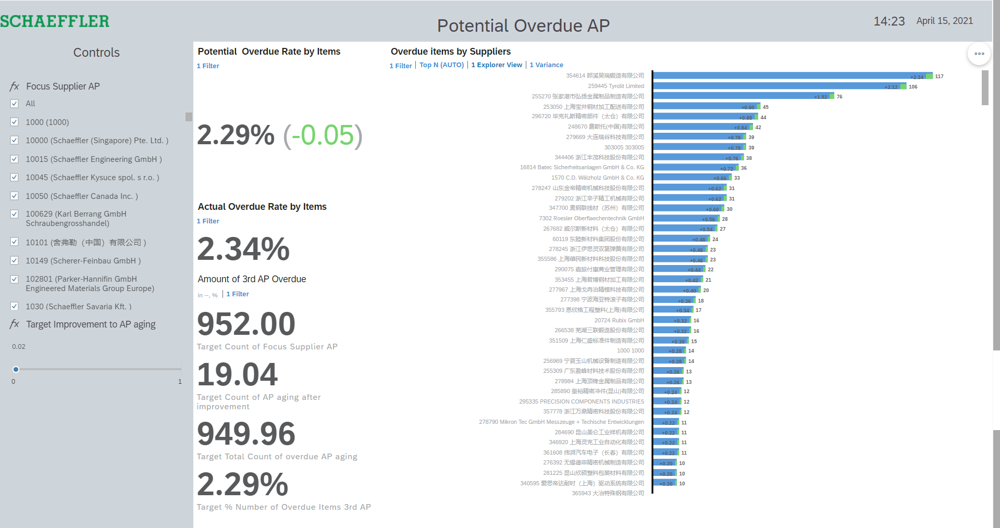
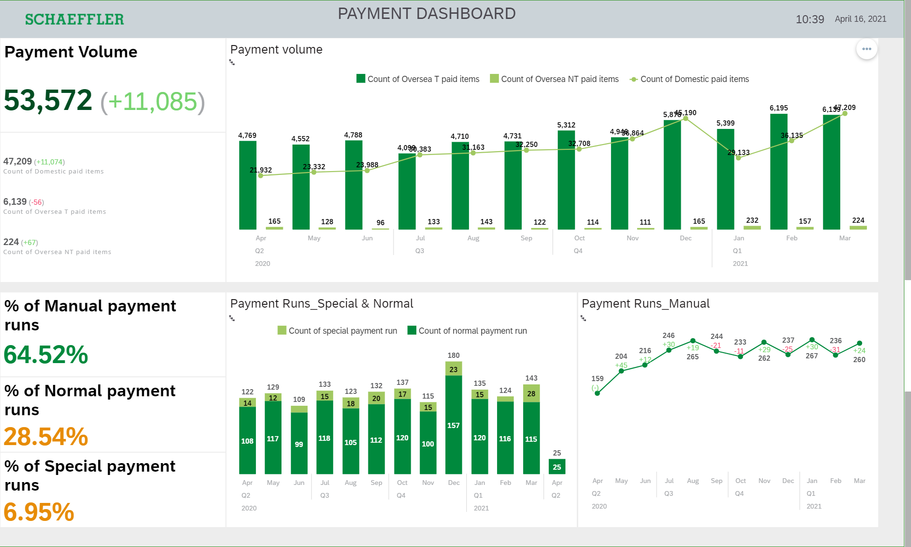
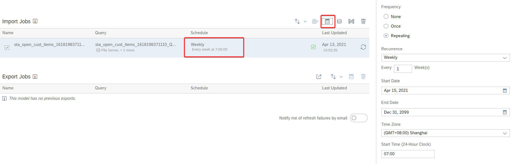

<!-- @import "[TOC]" {cmd="toc" depthFrom=1 depthTo=6 orderedList=false} -->

<!-- code_chunk_output -->

- [Introduction & Remarks](#introduction-remarks)
  - [Important](#important)
  - [Chapter1:](#chapter1)
  - [Chapter2:](#chapter2)
  - [Chapter3:](#chapter3)
- [The Framework for Business Process Improvement](#the-framework-for-business-process-improvement)
  - [The dashboard that shows just numbers misses the point.](#the-dashboard-that-shows-just-numbers-misses-the-point)
  - [The main job of the middle manager is process optimization.](#the-main-job-of-the-middle-manager-is-process-optimization)
  - [IDENTIFY / Is There a Problem?](#identify-is-there-a-problem)
  - [ANALYZE / What Caused the Problem?](#analyze-what-caused-the-problem)
  - [ACT / Which Actions Should We Take?](#act-which-actions-should-we-take)
  - [CHECK / Were the actions successful?](#check-were-the-actions-successful)
  - [How to improve even more!](#how-to-improve-even-more)
- [Designing an IT system to optimally support Business Process Improvement](#designing-an-it-system-to-optimally-support-business-process-improvement)
  - [Current System Landscape and it's Users](#current-system-landscape-and-its-users)
    - [Operational Reporting:](#operational-reporting)
    - [Core KPI Layer](#core-kpi-layer)
    - [Agile KPI Layer](#agile-kpi-layer)
  - [The Gap to Close](#the-gap-to-close)
  - [The best practice solution architecture](#the-best-practice-solution-architecture)
    - [Changeability & Extendability by Business](#changeability-extendability-by-business)
    - [Short Development Cycles](#short-development-cycles)
- [Implementation of the flexible data Warehouse](#implementation-of-the-flexible-data-warehouse)
  - [Systems](#systems)
    - [Data Factory](#data-factory)
    - [SQL Server](#sql-server)
    - [SAC Filserver:](#sac-filserver)
    - [SAC:](#sac)
- [Overall Data Flow](#overall-data-flow)
  - [Data Source](#data-source)
    - [SAP R3 Tables](#sap-r3-tables)
    - [External Excel Files](#external-excel-files)
    - [BW Reports](#bw-reports)
    - [EFLOW](#eflow)
- [Data Factory](#data-factory-1)
  - [Datasets](#datasets)
  - [Dataflows](#dataflows)
    - [General Data Flow logic](#general-data-flow-logic)
  - [Pipelines](#pipelines)
    - [Ingest Pipelines](#ingest-pipelines)
    - [Transformation Pipeline](#transformation-pipeline)
    - [Output Pipeline](#output-pipeline)
    - [Output Pipeline Schema](#output-pipeline-schema)
  - [Transport Changes from D-System to P-System](#transport-changes-from-d-system-to-p-system)
- [SQL Server](#sql-server-1)
  - [Key requirements for transformation stage:](#key-requirements-for-transformation-stage)
  - [Coding rules :](#coding-rules)
  - [Naming Conventions](#naming-conventions)
    - [Tables](#tables)
    - [Stored Procedures](#stored-procedures)
    - [Scalar Functions and ETL](#scalar-functions-and-etl)
    - [Schema](#schema)
    - [Execution from Datafactory](#execution-from-datafactory)
  - [CLEANED with ETL functions](#cleaned-with-etl-functions)
    - [p_cln_first](#p_cln_first)
    - [Config ETL Functions](#config-etl-functions)
    - [CLN_FI1000](#cln_fi1000)
  - [Transform 1 and Transform 2](#transform-1-and-transform-2)
    - [TP1_EKBE](#tp1_ekbe)
  - [Transform 3](#transform-3)
    - [P_TP30_ALL_ITEMS](#p_tp30_all_items)
      - [Key Date](#key-date)
      - [Recalculate Due Date and Arrears after Net](#recalculate-due-date-and-arrears-after-net)
    - [P_TP3_IRB](#p_tp3_irb)
    - [P_TP30_ALL_CUST_ITEMS](#p_tp30_all_cust_items)
      - [Recalculate Due Days based on VAT issue date](#recalculate-due-days-based-on-vat-issue-date)
      - [Include only specific documents for payment behavior calculation](#include-only-specific-documents-for-payment-behavior-calculation)
  - [Stage](#stage)
      - [STA_ALL_ITEMS](#sta_all_items)
      - [STA_OPEN ITEMS_MONTHLY](#sta_open-items_monthly)
      - [STA_IRB_FULL](#sta_irb_full)
      - [STA_IRB_MONTHLY](#sta_irb_monthly)
      - [STA_ALL_CUST_ITEMS](#sta_all_cust_items)
      - [STA_OPEN_CUST_ITEMS](#sta_open_cust_items)
      - [STA_EFLOW_CLR](#sta_eflow_clr)
      - [STA_EFLOW_LIKP](#sta_eflow_likp)
      - [STA_FI1000](#sta_fi1000)
      - [STA_PAYMENT_BEHAVIOR](#sta_payment_behavior)
      - [STA_*SCHEMA](#sta_schema)
  - [Transport Changes from D-System to P-System](#transport-changes-from-d-system-to-p-system-1)
- [SAP Analytics Cloud](#sap-analytics-cloud)
  - [File Server](#file-server)
  - [SAC Models](#sac-models)
    - [Model Settings](#model-settings)
    - [Story Overview](#story-overview)
      - [P2P Stories](#p2p-stories)
- [Monitoring](#monitoring)
  - [Data Flow](#data-flow)
  - [Flow Date Tracking](#flow-date-tracking)
    - [Export data from EP1](#export-data-from-ep1)
    - [Import data from EP1 and EFLOW to data lake](#import-data-from-ep1-and-eflow-to-data-lake)
    - [Running Pipeline in Data Factory](#running-pipeline-in-data-factory)
    - [Importing data to SAC](#importing-data-to-sac)
  - [Compare Q-D System](#compare-q-d-system)
  - [Pipeline runs](#pipeline-runs)
- [Frequent Questions / Issues / Requests](#frequent-questions-issues-requests)
  - [Requests](#requests)
    - [We (Business) want to add a new column to model X](#we-business-want-to-add-a-new-column-to-model-x)
    - [Add new BW cube to Solution Space](#add-new-bw-cube-to-solution-space)
- [Issues](#issues)
  - [We (Business) want to add a new calculated dimension but in SAC we get the following error](#we-business-want-to-add-a-new-calculated-dimension-but-in-sac-we-get-the-following-error)
  - [Business thinks that the data is wrong](#business-thinks-that-the-data-is-wrong)

<!-- /code_chunk_output -->


# Introduction & Remarks

The following whitepaper of the flexible data warehouse is a documentation of the business background (chapter 1), implementation concepts(chapter 2), and the actual implementation (chapter 3) of a project to gain insights into the business processes of a Shared Service Center. The solution enables effective process improvement, inevitably leading to cost savings that the automation KPI can track.

##Important

The knowledge that led to this document was not accumulated step by step in a waterfall fashion like it is written down, but rather through many iterations of try & error.

We wrote down the principles contained in chapter2 AFTER actually implementing them implicitly through many iterations. That makes them more valuable as they are tested and seem to work great in a real-world application.

##Chapter1:
Explains the use case from a business perspective. It is the summary of many discussions with the company's finance department and lays the foundation for the solution design.

Especially if you're an IT guy like me, this is a MUST read. Because we are fascinated by technology, we are all too often excited by flashy charts, AI analysis, and Demo videos.

**It is crucial to understand that just because something is technically possible does not mean it is valuable**.

The chapter shines a light on how business sees things.

##Chapter2:

This chapter builds on top of the first, discusses the necessity of a different approach for the agile KPI layer, and presents a working solution for its implementation. The chapter highlights the chosen architecture and outlines the benefits of the classic data warehouse and operational reporting.

##Chapter3:

This chapter is proof that this document is not just a consulting company slide-(shit)-show.

Through the last year, we implemented the flexible data warehouse described in chapter two. The chapter has two purposes. Firstly, be a maintenance guide to quickly lookup errors once they occur. Secondly, it shows the exact implementation steps and our thinking behind it to give a starting point for new use cases or extensions.

The coding samples do not include all coding but only the building blocks to explain how you can implement these principles. The code does not claim to be perfect but functional.

#The Framework for Business Process Improvement

## The dashboard that shows just numbers misses the point.

The first thought that comes to mind when thinking about Self Service BI is a beautiful dashboard that shows the critical business numbers while giving you an excellent overview of everything you need to know and how those numbers perform over a given time frame.

How could this not be helpful?

Well, let’s think about what the average middle manager that will use the tool later needs.

You might ask why only middle managers would use these tools. The simple answer is that if you had to prepare a C-level dashboard, it would be too big to consume.

It’s the Controller’s job to take and prepare presentations that point out the critical numbers on a given moment and prepare presentations that highlight their specific relevance. Designing an automated Dashboard fails as the story that the data needs to tell can vary significantly in a given circumstance.

In contrast, it seems useful that a Controller uses BI tools to make sense of the data before preparing a C-level presentation. With augmented analytics, a machine might do this prioritization of abnormal data in the future. However, the future is not now. At least not in your average industrial company.

Actually, the topic is quite big and deserves a separate post. For this article’s sake, let’s agree that the middle manager is the main target for Self Service BI tools.
##The main job of the middle manager is process optimization.
Process optimization is a multi-step process. Depending on your source, the number of steps and their names might vary. Generally speaking, it’s the following:

1. Identify that there is a problem
2. Analyze the root-cause
3. Define actions and execute them
4. Check if the actions were successful


The managers’ success is measured mainly by this task. That is correct in most cases as he is usually receiving a bonus based on how well the KPIs under his responsibility perform over a given period. Our goal is to design an information system to support him with this task. The best way to do that is to help him answer the main questions related to each step based on the data we have:

- Is there a problem?
- What caused the problem?
- Which actions should we take?
- Were the actions successful?

From looking at the questions above, you can already tell that the dashboard described at the beginning of this article only helps answer the first question. Most of the value that an automated analytics solution could have is left out.

Let’s have a look at how a more sophisticated solution could answer these questions. I took the screenshots from one of the actual dashboards we implemented at my company. To make it readable at this page layout, I included only the essential parts (lego bricks) of each dashboard part to get the point across. The numbers are anonymized.

##IDENTIFY / Is There a Problem?


In this screenshot, you can see the classic dashboard that usually gets printed on marketing materials. The actual numbers of last period’s KPI were placed on the left. Below you can see the trend over the previous months. If the KPI crosses a certain threshold, it turns green/red to indicate whether the result got better or worse than last month. For each KPI, you can jump to the root cause analysis by double-clicking.

##ANALYZE / What Caused the Problem?
The main idea is that a bad result is, in most cases, not caused by the average. Most of the time, outliers drag down the overall result. Consequently, showing a top-level KPI without quickly allowing for root cause analysis leads to ineffective actions as the vast majority of dimension members is not a problem. Problems often cluster around a particular attribute of a dimension that all members have in common.

For example, Suppliers based in Hong Kong perform worse than suppliers from other countries. It’s easy to then drill down into suppliers from Hong Kong.


By spreading out the KPI along critical dimensions and attributes, the manager can quickly narrow down the possible causes.

##ACT / Which Actions Should We Take?
As the time available to the team for making improvements is limited, it’s essential to prioritize effective actions. To find the most effective actions, we need to first think about which actions the manager can take and which dimensions will be influenced. Most of the time, it turns out to be not that many, so it’s even more important to know them. Examples might be his direct reports, specific system settings, and vendors or customers.

In the analysis section, we already discussed the importance of outliers. Outliers are exponentially more beneficial to work on as the same action is usually required to improve both an outlier and an average member, while the potential increase of the overall KPI is much greater with the outlier.


The graph above shows the top customers that had the worst impact on the KPI over the last period. Most of the time, we can calculate this by the overall KPI of the customer times the transaction/activity frequency. E.g., A frequent customer performing bad will drag down the overall KPI more than a one time customer.

When we compare this potential for improvement for each customer, we can see that customer 352581 has much more potential than customer 272873. Assuming the same amount of work is required to improve each customer, it’s a much better choice to work on customer 352581.

This shows that the impact we can have with our actions is more determined by which customers we chose in the first place than how well we carry out the activities.

Assuming we have time to work on the top 3 customers each month, we can now simulate the overall KPI outcome. You can see the second green bar on the leading three suppliers in image 4–1. Improving these customers with 90% confidence would result in below improvement on the overall KPI.


Confidentiality and customer choice can be adjusted without additional effort, which allows the manager to simulate possible actions, formulate the best measures, and set a realistic target for the next period.

Including the managers’ expert business knowledge in this step is essential as specific customers will have more or less business in the future, or some customers might be harder to handle than others.
##CHECK / Were the actions successful?


Setting a goal to achieve for each period helps the manager understand if the defined actions were successful. It’s a step often overlooked but extremely important because it shows the improvement over time and, therefore, the team’s work.

In a real-world scenario, the chart never increases steadily but looks more like the stock market’s ups and downs. As with the stock market, if the trend goes up, the actions are successful. If decreases can be explained (e.g., CoVid19), everything is fine.


The chart shows the target SET for each month compared to the actual figures.


You can think of the improvement process as a circle that continually iterates, moving upwards in the best case.

Similarly, the dashboard's value can be judged by the value difference between the introduction and the current period over time.

However, it’s essential to understand that the actions taken and not the dashboard itself are responsible for the improvement.

##How to improve even more!
As there is no perfect solution, there is one feature missing I would hope SAP would implement in the future:
All actions coming from the insights must be captured and followed up outside the tool. I would love to see integrated task management or direct integration to a tool like Trello that helps create and follow up on tasks derived from insights.

#Designing an IT system to support Business Process Improvement optimally

## Current System Landscape and its Users


The image above shows in a very simple way the user groups that consume reporting (y) and the frequency reporting is needed by them (x). Each group and frequency has different requirements on relevant information and the way to consume it.

###Operational Reporting:
Operational reporting is the reporting layer used by specialists on a day-to-day basis to verify the daily operations and smoothness of processes in the systems. Questions that a reporting system in this layer needs to answer are, e.g.:

1. Were all invoices posted?
2. Have all goods been sent out to the customer?
3. Are there any processing errors?

The focus for this kind of reporting lies in the actuality of the data. This layer is also the only kind of reporting that justifies the struggle to have a real-time view of processes on the system.

Gladly, daily reporting does not have deep analysis requirements as time is usually too short to spend much of the day on analysis. Therefore a quick reporting is generally set up in the system where the specialist acts.

Summary Operational Reporting:
- Fast
- Stable
- Easy
- Source System capability

###Core KPI Layer

The Core KPI Layer (yellow) contains the top KPIs that are necessary to run the company. These KPIs are crucial and must be comparable over long periods. Decisions made at this level are strategic and take time to show their impact on the actual data.

A system that produces these figures must be stable, reliable, and able to deal with vast amounts of data. These requirements cause the system to have long development cycles and data load restrictions due to the massive data.

Traditionally most companies have a sophisticated data warehouse solution that deals with the core KPI layer requirements. As described in chapter 1, it's usually the Controllers Job to find and prepare the critical data points in a meaningful way and present them to the top management.

Summary Core KPI Layer:

- Stable
- Reliable
- Long Development Cycles
- Huge Volumes of Data
- Business Warehouse system and Controllers job

###Agile KPI Layer

The Agile KPI Layer(green) contains all the error analysis, reporting, and nitty-gritty that the middle manager needs to run the business under his responsibility. The insights that a middle manager wants to derive from data are more in the short term but need to be more flexible than top management requirements, and data volumes needed are smaller but need to be more detailed.

Traditionally companies rely on the swiss army knife of software: Excel.
This flexibility is paid for by much manual work, errors, and shallow analysis.

Summary Agile KPI Layer:

- Flexible
- Short development Cycles
- Small / Midsize volumes of data
- Excel

## The Gap to Close

We see that from the three reporting layers, the agile KPI layer is the one with the least software support. The lack of software support is mainly because this space is the newest. Previously Excel and operational reports were just enough to handle those requirements. However, the increase in data collection and the decentralization of tasks in a Shared Service Center make it less and less feasible to handle these tasks in Excel.

Furthermore, computing and storage costs have decreased tremendously over the last years, turning the cost-benefit analysis in favor of an automated solution in many more cases. These developments lead to a widening gap that is not adapted by many companies today.  

## The best practice solution architecture

The first thought of just increasing Operational Reporting capability or building more Data Warehouse reports falls short, looking at the very different nature of the agile KPI layer.

The show stopper for integrating the agile requirements into the core KPI layer is the long development cycles and IT effort involved.

The operational Reporting falls short in the source systems capabilities for advanced analysis. Additionally, a source system reporting only allows insight into the data that that specific source system holds. Often insights are gained by combining data from many data sources along the process.

We tried only using Self Service BI tools (SAP Analytics Cloud or Power BI) to fulfill the requirements in our first rotation of development. While those tools have very impressive calculation and presentation capabilities, they lack the modeling and automation ability to handle dataset joins that lead to result tables in the size of 1M rows and 100 columns.

In our experience, after around 25M cells, it gets messy. Calculations have long run times or fail. Joins with more than five tables are hard to work with at any size.

This lead to frustration and confusion for our business department and us into adapting the below approach.


The image shows the final architecture of the flexible warehouse.

1. Data is initially extracted from many different source systems. In our case, this is:

an SAP R3 System (EP1)
an SAP BW system that sits on top of the SAP R3 System
an external Business Workflow system called EFLOW
additional excel files that contain additional business logic or report downloads from other software that is not yet automatically connected.

2. Data is extracted from the SAP EP1 system and EFLOW system weekly into the company data lake.

3.We can access the data from the data lake, BW, and Excel with the help of the Microsoft Azure Data Factory.

4. A data warehouse is set up in the Azure SQL Server that executes ETL functions and adds business logic where necessary.

5. The result of this transformation is data model tables that BI tools like SAP Analytics Cloud or Microsoft Power BI can access.

Let's look at the advantages and trade-offs that this architecture makes to make it a much better fit for the agile KPI Layer and fulfill the requirements for agility while providing automation that allows for deep root cause analysis.

### Changeability & Extendability by Business


To achieve that, we have first to transfer the knowledge of how to design and build dashboards and reports with self-service BI tools to business. Handing governance of the display layer over to business gives them all the freedom they had with Excel while automating the data preparation and later the consumption of the report. Everything in the presentation area is business responsibility (right to the green line)

Training a group of key-users is only possible through hands-on training and persistence as it takes a while to get through the highs and lows of adapting to new technology.

In our experience, around 90% of business logic and KPI can be calculated on the fly in the BI tool and are therefore under complete control of the business department, changing them in self-service manner if needed. Contrary to a BW system where the business logic is calculated in the reporting cube and set up by IT.

The second requirement of change is adding additional data or dimensions. Adding further data quickly is possible because we can merge each model table of the flexible data warehouse with other manually added data and then joined. This way, business can quickly add additional dimensions.


These two types of change we call Type 1 changes. They have high flexibility, are easy to implement, and **don't involve any IT staff**. Business can try out new ideas and additional requirements his way.

There is a trade-off in that these type1 changes increase complexity for business to handle and decrease automation as the key users must maintain the additional files manually.

Because of that, there is another change we call type2 change. A type2 change is always preceded by a Type1 change that serves as the blueprint for the type 2 change. A type2 change moves the data source further back in the pipeline to automate the extraction and processing.


This move will increase automation and decrease complexity for business as the processing is now handled automatically in the pipeline. However, it involves IT effort and additional testing of all affected data streams.

Handling changes in this two-step approach also decreases friction between Business and IT department where business fails to exactly describe what they want (IT perspective :) ) or IT fails to understand the business idea (Business perspective :) ) as the type1 change serves as a blueprint.

Optimally, we combine many Type1 changes into one bigger Type2 change as testing, and we can significantly reduce implementation effort this way.

As below shown as business value created by changes over time


### Short Development Cycles

Short development cycles are achieved by decreasing complexity. One big part of that is the change strategy introduced in the previous chapter. It enables leaving business logic to business.

Several other technical design principles ensure short development cycles.

**The more frequently a logic/procedure changes, the closer to the end we should put it in the pipeline**

In our case, this means the following:


Until the green line, there is no logic whatsoever. The tables from the source systems are loaded entirely and without any delta update logic. Contrary to a BW solution, the data volume is not huge, and storage and compute power are cheap nowadays.

Until the orange line, we filter the data by very high-level case specifics, e.g., Data from Chinese Entities.

Until the blue line, only general ETL functions prepare the data. There is still no specific logic.

Until the red line, tables are prepared and joined only into their natural objects. e.g., SAP Invoice, Credit Line Workflow, etc.

Only after the red line business logic and frequently changing transformations take place.

This layered approach keeps the core stable, easy while allowing for more frequent change. We can make the changes most of the time without touching anything behind the red line. The only exception being big Type2 changes.

**Avoid storage tables completely**

In the flexible data warehouse, We should completely recreate ALL tables with each pipeline run. Following this rule allows us to add additional columns and calculations without worrying about any legacy data.

I'll repeat it because this is huge! In the flexible data warehouse, we don't have to worry about any legacy data!

Getting rid of storing legacy data means that we don't have to write complex update routines for our tables or manually add legacy columns after downloading them. There are no slowly changing dimensions needed to be taken care of.

This eliminates the biggest source of errors and manual work in the development cycle and is the most significant difference compared to the classic BW system that has to do complex delta updates. Partly because in the past, it was necessary and partially because the data used is enormous.

The trade-off, in that case, is less manual work and higher stability for accuracy. If legacy data is changed in the source system, it is also changed in our flexible data warehouse. E.g., If a supplier name is changed, it is also adjusted for all legacy data under that supplier number.

In the flexible warehouse, we are very willing to make this trade-off. For the core KPI layer, it might be a different discussion.

#Implementation of the flexible data Warehouse

##Systems

###Data Factory

D-System:
https://adf.azure.com/en-us/authoring/dataflow/O2C_INGEST_ACCOUNTS_RECEIVEABLES?factory=%2Fsubscriptions%2F770faa00-73c9-4505-be0e-9fd399518c7f%2FresourceGroups%2Fsdp-s-fssc%2Fproviders%2FMicrosoft.DataFactory%2Ffactories%2Fsdp-s-d-fssc-df

P-System
https://adf.azure.com/en-us/authoring?factory=%2Fsubscriptions%2F11737385-67b3-4577-8eb6-d5e4551e47e3%2FresourceGroups%2Fsdp-s-fssc%2Fproviders%2FMicrosoft.DataFactory%2Ffactories%2Fsdp-s-p-fssc-df

###SQL Server

D-System:

sdp-s-d-sqls.database.windows.net

P-System:

sdp-s-p-sqls.database.windows.net

###SAC Filserver:

Input External Excel files

[\\schaeffler.com\herzogenaurach\DATA\SZ-HZA-Z\Projects\BW_SAC_Upload\FI\FSSC_IMPROVEMENT_FRAMEWORK\INPUT](\\schaeffler.com\herzogenaurach\DATA\SZ-HZA-Z\Projects\BW_SAC_Upload\FI\FSSC_IMPROVEMENT_FRAMEWORK\INPUT)


Export Models

[\\schaeffler.com\herzogenaurach\DATA\SZ-HZA-Z\Projects\BW_SAC_Upload\FI\FSSC_IMPROVEMENT_FRAMEWORK\OUTPUT](\\schaeffler.com\herzogenaurach\DATA\SZ-HZA-Z\Projects\BW_SAC_Upload\FI\FSSC_IMPROVEMENT_FRAMEWORK\OUTPUT)


Additional Files by Business:

[\\schaeffler.com\herzogenaurach\DATA\SZ-HZA-Z\Projects\BW_SAC_Upload\FI\FSSC_IMPROVEMENT_FRAMEWORK\ExcelUpload](\\schaeffler.com\herzogenaurach\DATA\SZ-HZA-Z\Projects\BW_SAC_Upload\FI\FSSC_IMPROVEMENT_FRAMEWORK\ExcelUpload)

###SAC:

https://schaeffler-technologies.eu10.sapanalytics.cloud/sap/fpa/ui/app.html#;view_id=home

#Overall Data Flow

##Data Source

###SAP R3 Tables

ZSI_IR_IC_OCRLOG
EKKO
EKBE
EBAN
T001
VF_KRED
ADRC
T024
T001S
BSAK
BKPF
BSIK
REGUP
BSID
BSAD
FDM_DCPROC
UDMCASEATTR00
SCMG_T_CASE_ATTR
LIKP
VBUK
KNA1
KNB1
T052
KNKK
 
###External Excel Files

INX_OVERDUE_REASON
INX_PAYMENT_CALENDAR
INX_TRADESHIFT_INVOICES
INX_SAMPLE_ORDERS

###BW Reports

FI5000 - Vendor incoming invoices
Fi1000 - DSO

###EFLOW

v-dp-proc-048-dnno
v-dp-tasks

#Data Factory

##Datasets


**Source:**

|  Dataset  |Content   |
|---|---|
|DS_BW_FI5000   |  Input for BW Report FI 5000 |
|DS_BW_FI1000|Input for BW Report FI 1000
|DS_EXCEL|Input for Additional Excel files
|DS_SDPHUB_EFLOW|Input for EFLOW data
|DS_SDPHUB_SAPR3|Input All SAP Tables
|DS_SDPHUB_SAPR3|Input All SAP Tables RAW - currently not used

**Transformation**

|  Dataset | Content  |
|---|---|
|DS_P2P_SQL_SERVER   | All Tables on SQL Server WAVEI  |
|DS_O2C_SQL_Server |All Tables on SQL Server WAVEII

**Output**

|Dataset   |Content   |
|---|---|
| DS_CSV  |  Output all Files as CSV (Output as Excel not supported)  |

##Dataflows


|Dataflow   |Content   |
|---|---|
|P2P_INGEST_DATA_ACCOUNTS_PAYABLES|Ingest of Accounts Payables data to SQL Server
|P2P_INGEST_DATA_PAYMENTS |Ingest of Payments data to SQL Server
|P2P_INGEST_DATA_GENERAL| Ingest of all general data/master Data to SQL Server
|O2C_INGEST_ACCOUNTS_RECEIVEABLES|Ingest of Accounts Receiveables  data to SQL Server|
O2C_INGEST_DATA_EFLOW| Ingest of EFLOW and BW data to SQL server
|O2C_INGEST_DATA_GENERAL|Ingest of general data to SQL Server

>>Note: In general all of these flows could be combined into one for each o2c and p2p. However it's easier for debugging and in the future the parts might have to run separately due to different business requirements by each department.

###General Data Flow logic


**1. Import data from Datasource for a specific table**


>a. set correct wildcard filepath to find corresponding table on datalake
>b. store filepath in column to enable check in SQL server later  

**2. Select relevant columns from table and rename them into names that make sense**

>Do this step as early as possible to work with 'real names'. Use these consistently

**3. Filter relevant Data**


>Use filters do exclude not needed data. Exclude as much as possible in data flows as they run on Spark Cluster! Performance is much better than in the SQL Server

**4. Merge Data**


>Only include data from the tables that are included in the facts tables from BW >report FI5000. Again, exclude as much as possible on Spark Cluster.

**5. Add Dowload date to double check when data was last downloaded**


>Very important to be able to follow through on when the data was downloaded. Check Monitoring Chapter for details

**6. Insert remaining rows into target SQL Server**


Use recreate table to delete and recreate the target tables with each load. Avoid duplicates.

**For each table there is a similar dataflow according to above schema**


##Pipelines


|  Pipeline | Function  |
|---|---|
| PIP_TEST|Dummy used for tests. Not used in weekly run.
|PIP_O2C_INGEST|Ingest all O2C data to SQL Server
|PIP_O2C_TRANSFORM|Execute all O2C Transformation in SQL Server
|PIP_O2C_OUTPUT|Output all O2C data onto SAC Fileserver
|PIP_O2C_OUTPUT_SCHEMA|Prints first 500 rows of each O2C model to SAC server.Used to speed up model updates in SAC. **Not used in weekly run**
|PIP_P2P_INGEST|Ingest all P2P data to SQL Server
|PIP_P2P_TRANSFORM|Execute all P2P Transformation in SQL Server
|PIP_P2P_OUTPUT|Output all P2P data onto SAC Fileserver
|PIP_P2P_OUTPUT_SCHEMA|Prints first 500 rows of each P2P model to SAC server. Used to speed up model updates in SAC. **Not used in weekly run**

The Pipelines are structured in 3 parts:
1. Ingest from data lake
2. Transformation on the SQL Server
3. Output to SAC Fileserver

### Ingest Pipelines

Both Ingest Piepelines work in the same way:


**1. Executes Data Dataflows to get SAP Tables from Datalake**


a. Parameters from Dataflows must be entered here. In our case it's the SQL Server table names

>For each dataflow we can variably select the "Run On". If there is a lot of data we can use more CPUs to speed up the processing. This is more expensive though.

**2. Copy Data from BW Cubes**


In copy data step you can directly query SQL statements against the denodo baseview of the query. There is now delay in getting the data from BW.

> You can easily use dynamic parameters in this select statement.

```SQL
SELECT *
FROM connection_layer_ucd.bv_sapbw_bp1_fssc_framework_improvment_fi1000
WHERE monthyearfrompostingdatedefaultfromexitme_0  = '@{getPastTime(1,'Month','MM.yyyy')}' AND
(
companycode_key_0 = 'EP1_100/0083' OR
companycode_key_0 = 'EP1_100/0189' OR
companycode_key_0 = 'EP1_100/0199' OR
companycode_key_0 = 'EP1_100/0289' OR
companycode_key_0 = 'EP1_100/0371' OR
companycode_key_0 = 'EP1_100/0369' OR
companycode_key_0 = 'EP1_100/0377' OR
companycode_key_0 = 'EP1_100/0404' OR
companycode_key_0 = 'EP1_100/0426' OR
companycode_key_0 = 'EP1_100/0429' OR
companycode_key_0 = 'EP1_100/0078'
)
```

**3. Copy external Excel files**

Excel files can be imported directly fromm the directory in the dataset. You can enter the filename in the settings as parameter.


**4. Special**

The only kind of special case is this SQL server procedure that is executed in the ingest pipeline. It's needed to pre-format the data from BW so that the dataflows can merge the data with the SAP tables.


### Transformation Pipeline

The Transformation Pipeline is used to execute the stored procedures on the SQL-Server in a procedural manner. More information will be provided in the Chapter about the SQL Server


### Output Pipeline

The output pipelines copy the data from the model tables in SQL server onto the SAC fileserver. It's possible to do another mapping here between SQL Server column name and SAC column name.


### Output Pipeline Schema

The model mapping function in SAC is very slow if there is a lot of data uploaded. THis pipeline only print the 500 first rows of each model into the csv file. If there needs to be a new mapping business will ask it to print only the schema to do the mapping. Afterwads the full dataset can be loaded automatically.  

## Transport Changes from D-System to P-System


The data factory is connected to GIT version control. After changes in d-system are done they can be published via the publish button. Afterwards HQ needs to be contacted to move the changes to P-System.

#SQL Server

##Key requirements for transformation stage:

1. The pipeline has to be procedural on each step in the data factory. If one step fails the pipeline must be able to only rerun from the failed activity to avoid long runtimes
--> Oil in a Pipeline also does not flow back ;-)

2. Errors should be traceable as easy and fast as possible.

3. Make solution scalable for future demands

## Coding rules :

1. Each Stored procedure is only allowed to work with tables of the same name stage or lower:
E.g. Stored procedure CLN can only work with tables CLN and ING
TP1 only with CLN/ING/TP1 etc.
2. Each task for each table in each step gets it’s own stored procedure with the tables name as procedure name.
e.g. Step to clean table CLN_ADRC is called P_CLN_ADRC

3. Strictly follow transformation structure for all tables


## Naming Conventions

###Tables

1. INGESTED from Data Factory 
Table Names ING_* for SAP&BW / INX_*  for Excel

>Original tables from data lake. Should never be changed to avoid having to run INGEST Pipeline again

2. CLEANED  with ETL functions
Table Names CLN_*

3. TRANSFORM1 Join Data together
Table Names TP1_*

4. TRANSFORM2 Join Data together
Table Names TP2_*

5. TRANSFORM3 Calculate additional Columns
Table Names TP3_*

6. STAGE data for Export to Fileserver
Table Names STA_*

### Stored Procedures

1. Stored Procedures Names *_EXEC
Are executed from Azure Data Factory

2. Stored Procedure Names P_CLN_*
Apply all the ETL functions and data cleaning

3. Stored Procedure Names P_TP1*
Join Cleaned Tables

4. Stored Procedure Names P_TP2*
Join the Dimensions and Facts tables together

5. Stored Procedure Names P_TP3*
Apply Business logic and calculate additional columns

6. Stored Procedure Names P_STA*
Create different views that can be consumed via Analytics tools.

### Scalar Functions and ETL

ETL functions and Scalar functions are named after what they do. They only do one thing. This is especially important because SQL Server does not have a debugger


### Schema

1. dbo
  Everything related to Purchase to Pay Process

2. o2c
  Everything related to Order to Cash Process

>Currently everything in schema dbo is written in upper case. Everything in o2c is written in lower case. This is legacy and should be changed in the future to all lower case. Also, all p2p tables should be moved to a new schema called p2p. Everything that's used for both like ETL functions should be kept in dbo (default schema)

### Execution from Datafactory

Not all stored procedures are executed from Azure Cloud. Only the 5 main procedures are controlled via Azure Data Factory:


>This is a trade off between monitoring capability in Data Factory and practicality of use. If every procedure is in ADF, the stored procedure that can be identified directly must be setup and published one by one and adjusted with every change. The *_EXEC Procedures help to structure the procedures while allowing quick changes without changing the overall flow in ADF.

## CLEANED with ETL functions


```SQL
alter procedure [dbo].[p_cln_exec] as

-- first---------------------------------------------------------------------

exec p_cln_first

exec o2c.p_cln_src_download_date @schema = 'dbo'

exec p_cln_load_details
----------------------------------------------------------------------------

exec p_cln_adrc

exec p_cln_bkpf

exec p_cln_bsik

exec p_cln_eban

exec p_cln_ekbe

exec p_cln_ekko

exec p_cln_overdue_reason

exec p_cln_payment_calendar

exec p_cln_t001s

exec p_cln_t024

exec p_cln_vf_kred

exec p_cln_ocrlog

exec p_cln_t001

exec p_cln_bsak

exec p_cln_regup

exec p_cln_ts_invoices

--last   ---------------------------------------------------------------------------

exec o2c.p_cln_clean_columns @schema  = 'dbo'
```

### p_cln_first

1. Copies all data from ING_* to CLN_*. Creates indexed tables one by one. Adds additional columns.

```SQL
declare @table table
(
tablename varchar(50),
id int identity(1,1)
)

insert into @table
select distinct table_name from information_schema.columns
where left(table_name,2) = 'in' and
	 table_name <> 'ing_fi5000' and
	 table_name <> 'ing_eflowtask' and
     table_schema = @schema

declare @max int
declare @sql varchar(max)
declare @tablename varchar(50)
declare @id int = 1

select @max = max(id) from @table

while (@id <= @max)
begin

select @tablename = tablename from @table where id = @id
set @sql =     'drop table if exists '+@schema+'.cln'+substring(@tablename,4,20)+';
				select * into '+@schema+'.cln'+substring(@tablename,4,20)+' from '+@schema+'.'+@tablename+''

--print(@sql)
exec(@sql)
set @id = @id +1
end
```

2. Sometimes there are two files on the datalake. Therefore it's necessary to remove duplicates for each of the ingested tables.

Example for P2P:

```SQL
alter procedure [dbo].[p_cln_bsik] as

with bsik_duplicates as (
    select *,
        row_number() over (
            partition by
                company_code,
				document_number,
				[year],
				line_item
		    order by
                company_code,
				document_number,
				[year],
				line_item
        ) row_num
     from
        cln_bsik
)

delete from bsik_duplicates
where row_num > 1
```

Example For O2C:

```SQL
alter procedure [o2c].[p_cln_bsad] as

delete from o2c.cln_bsad
where file_path <> (select max(file_path) from o2c.cln_bsad)

update o2c.cln_bsad
set o2c.cln_bsad.src_download_date  = src.src_download_date
from o2c.cln_load_details as src
where table_name = 'BSAD'
```

>The P2P Method has a longer runtime but makes sure that there can't be any duplicates, even if there would be an error in SAP while the option that was implemented for O2C is faster but in principle could still contain duplicaes if they existed in Source side.

3. Remove Characters that can't be used in CSV File

```SQL
declare @table table
(
tablename varchar(50),
columnname varchar(50),
id int identity(1,1)
)

insert into @table(tablename,columnname)
select table_name, column_name from config
where function_name = 'CLEAN_COLUMNS'
and db_schema = @schema

declare @max int
declare @sql varchar(max)
declare @tablename varchar(50)
declare @columnname varchar(50)
declare @id int = 1

select @max = max(id) from @table

while (@id <= @max)
begin

select @tablename = tablename, @columnname =columnname from @table where id = @id

set @sql =  'update '+@schema+'.'+@tablename+' set '+@columnname+' = replace('+@columnname+','','','''');
			 update '+@schema+'.'+@tablename+' set '+@columnname+' = replace('+@columnname+',''"'','''');	'

exec(@sql)

set @id = @id +1
end
```

The STA_* tables  are later printed as CSV files because SAP Analytics Cloud can currently not work with direct SQL access. Using CSV files has the disadvantage that the characters ',' and '"' can't be used.

',': It will cause the csv file to think the next column already starts and therefore mess up the whole file  
' " ': This character will tell the system to no regards this ',' as a separator which means that if itis at the end of a column can combine two columns and mess up the file.

### Config ETL Functions

Most ETL functions can be controlled via the config file in Excel.


- Function name: Name of the ETL function
- Table Name: Table for which the function should be executed
- Column Name: Column for which the function should be executed
- Parameter: Additional Parameters that the function might need
- Active: The line is active or not
- DB Schema: Database Schema for which the function should be executed

Currently there are 3 functions controlled with the config file that are used at several places in the pipeline:

- ADD_ZERO
- REMOVE_ZERO
- CLEAN_COLUMNS

```SQL
ALTER procedure [o2c].[p_execute_etl_function] @imp_function nvarchar(max),
												@imp_tablename nvarchar(max),
												@schema varchar(max)
as

declare @table table
(
table_name varchar(max),
column_name varchar(max),
parameter varchar(max),
id varchar(max)
)

declare @max int
declare @sql varchar(max)
declare @tablename varchar(50)
declare @columnname varchar(50)
declare @parameter varchar(max)
declare @id int = 1

insert into @table(table_name, column_name, parameter, id)
select table_name, column_name, parameter, row_number() over (order by table_name, column_name desc) as id from config
where function_name = @imp_function and active = 'x' and table_name = @imp_tablename and db_schema = @schema

select @max = max(id) from @table

while (@id <= @max)
begin

	select @tablename = table_name, @columnname = column_name, @parameter = parameter from @table where id = @id

	if @imp_function = 'REMOVE_ZERO'
	begin
	set @sql =  'update '+@schema+'.'+@tablename+ ' set '+@columnname+' = substring('+@columnname+', patindex(''%[^0]%'', '+@columnname+'+''.''), len('+@columnname+'))'
	end

	if @imp_function = 'ADD_ZERO'
	begin
	if @parameter = '10'
	begin
	set @sql = 'update '+@schema+'.'+@tablename+' set '+@columnname+' = right(''0000000000''+isnull('+@columnname+',''''),10)'
	end
	if @parameter = '4'
	begin
	set @sql = 'update '+@schema+'.'+@tablename+' set '+@columnname+' = right(''0000''+isnull('+@columnname+',''''),4)'
	end
	end

	exec (@sql)

	set @id = @id +1
end
```


### CLN_FI1000

In order to make good use of FI1000 BW Query it must be unpivoted. Currently it ontains one measure for each month of sales. This way it can not be displayed correctly in any BI tool. This routine takes columns for each month and combines them into one column with the values and one date column for the month.

```SQL
alter procedure [o2c].[p_cln_fi1000] as

declare @inyearmonth nvarchar(10)
declare @fulldate nvarchar(10)
declare @initdate date
select @inyearmonth = max(monthyearfrom) from o2c.ing_fi1000
select @fulldate = concat(right(@inyearmonth,4),left(@inyearmonth,2),'01')
select @initdate = convert(date,@fulldate,102)

drop table if exists o2c.#bwfi1000ar
select company_code, customer_number,business_division,business_unit,credit_control_area,division,
    case yearmonth
     when 'ar_month_0' then @initdate
	 when 'ar_month_1' then dateadd(month,-1,@initdate)
	 when 'ar_month_2' then dateadd(month,-2,@initdate)
	 when 'ar_month_3' then dateadd(month,-3,@initdate)
	 when 'ar_month_4' then dateadd(month,-4,@initdate)
	 when 'ar_month_5' then dateadd(month,-5,@initdate)
	 when 'ar_month_6' then dateadd(month,-6,@initdate)
	 when 'ar_month_7' then dateadd(month,-7,@initdate)
	 when 'ar_month_8' then dateadd(month,-8,@initdate)
	 when 'ar_month_9' then dateadd(month,-9,@initdate)
	 when 'ar_month_10' then dateadd(month,-10,@initdate)
	 when 'ar_month_11' then dateadd(month,-11,@initdate)
	 when 'ar_month_12' then dateadd(month,-12,@initdate)
   end as postdate, 'aramount' as category, amount
 into o2c.#bwfi1000ar
 from
(
	select  company_code,customer_number,business_division,business_unit,credit_control_area,division,ar_month_0 , ar_month_1,ar_month_2,
	      ar_month_3,ar_month_4,ar_month_5,ar_month_6,ar_month_7,ar_month_8,ar_month_9,ar_month_10,ar_month_11,ar_month_12
	from o2c.ing_fi1000
)  p

unpivot (
    amount for yearmonth in (ar_month_0,ar_month_1,ar_month_2,ar_month_3,ar_month_4,ar_month_5,ar_month_6,ar_month_7,ar_month_8,ar_month_9,ar_month_10,ar_month_11,ar_month_12)
	)
 as unpvtar;


drop table if exists o2c.#bwfi1000sales
select company_code, customer_number,business_division,business_unit,credit_control_area,division,
    case yearmonth
     when 'sales_month_0' then @initdate
	 when 'sales_month_1' then dateadd(month,-1,@initdate)
	 when 'sales_month_2' then dateadd(month,-2,@initdate)
	 when 'sales_month_3' then dateadd(month,-3,@initdate)
	 when 'sales_month_4' then dateadd(month,-4,@initdate)
	 when 'sales_month_5' then dateadd(month,-5,@initdate)
	 when 'sales_month_6' then dateadd(month,-6,@initdate)
	 when 'sales_month_7' then dateadd(month,-7,@initdate)
	 when 'sales_month_8' then dateadd(month,-8,@initdate)
	 when 'sales_month_9' then dateadd(month,-9,@initdate)
	 when 'sales_month_10' then dateadd(month,-10,@initdate)
	 when 'sales_month_11' then dateadd(month,-11,@initdate)
	 when 'sales_month_12' then dateadd(month,-12,@initdate)
   end as postdate, 'salesamount' as category,amount
 into o2c.#bwfi1000sales
 from
(
	select  company_code,customer_number,business_division,business_unit,credit_control_area,division,sales_month_0 , sales_month_1,sales_month_2,
	      sales_month_3,sales_month_4,sales_month_5,sales_month_6,sales_month_7,sales_month_8,sales_month_9,sales_month_10,sales_month_11,sales_month_12
	from o2c.ing_fi1000
)  p

unpivot (
    amount for yearmonth in (sales_month_0,sales_month_1,sales_month_2,sales_month_3,sales_month_4,sales_month_5,sales_month_6,sales_month_7,sales_month_8,sales_month_9,sales_month_10,sales_month_11,sales_month_12)
	)
 as unpvtsales;


 -- unpivot overdue amount
drop table if exists o2c.#bwfi1000overdue
select company_code, customer_number,business_division,business_unit,credit_control_area,division,
    case yearmonth
     when 'overdue_month_0' then @initdate
	 when 'overdue_month_1' then dateadd(month,-1,@initdate)
	 when 'overdue_month_2' then dateadd(month,-2,@initdate)
	 when 'overdue_month_3' then dateadd(month,-3,@initdate)
	 when 'overdue_month_4' then dateadd(month,-4,@initdate)
	 when 'overdue_month_5' then dateadd(month,-5,@initdate)
	 when 'overdue_month_6' then dateadd(month,-6,@initdate)
	 when 'overdue_month_7' then dateadd(month,-7,@initdate)
	 when 'overdue_month_8' then dateadd(month,-8,@initdate)
	 when 'overdue_month_9' then dateadd(month,-9,@initdate)
	 when 'overdue_month_10' then dateadd(month,-10,@initdate)
	 when 'overdue_month_11' then dateadd(month,-11,@initdate)
	 when 'overdue_month_12' then dateadd(month,-12,@initdate)
   end as postdate, 'overdueamount' as category, amount
 into o2c.#bwfi1000overdue
 from
(
	select  company_code,customer_number,business_division,business_unit,credit_control_area,division,
	overdue_month_0 , overdue_month_1,overdue_month_2,overdue_month_3,overdue_month_4,overdue_month_5,overdue_month_6,overdue_month_7,overdue_month_8,
	overdue_month_9,overdue_month_10,overdue_month_11,overdue_month_12
	from o2c.ing_fi1000
)  p

unpivot (
    amount for yearmonth in (overdue_month_0 , overdue_month_1,overdue_month_2,overdue_month_3,overdue_month_4,overdue_month_5,overdue_month_6,
	   overdue_month_7,overdue_month_8,overdue_month_9,overdue_month_10,overdue_month_11,overdue_month_12)
	)
 as unpvtoverdue;

 drop table if exists o2c.#bwfi1000
 select *  into o2c.#bwfi1000 from o2c.#bwfi1000ar
 union all
 select * from o2c.#bwfi1000sales
 union all
 select * from o2c.#bwfi1000overdue

 --pivot
 drop table if exists o2c.cln_fi1000
 select company_code,customer_number,business_division,business_unit,credit_control_area,division,postdate,
 isnull(aramount,0) aramount ,isnull(salesamount,0) salesamount ,isnull(overdueamount,0) overdueamount
 into o2c.cln_fi1000
 from
 (
 select company_code,customer_number,business_division,business_unit,credit_control_area,division,postdate,category,amount from o2c.#bwfi1000
 )p
  pivot
 (
    sum(amount) for category in (aramount,salesamount,overdueamount)
 ) as pvt

  order by  postdate

   drop table if exists o2c.#bwfi1000ar
   drop table if exists o2c.#bwfi1000sales
   drop table if exists o2c.#bwfi1000overdue
   drop table if exists o2c.#bwfi1000
```

## Transform 1 and Transform 2

In these stages all Joins are done. The Joins can only access tables that are in CLN stage or CLN and TP1 for Transform 2.

Transform 1 joins tables to Dimensions that can then be resued to join with multiple other FACT tables to the base models. e.g. combines the customer master tables KNA1 and KNB1 to the dimension customer.

|  Model | sta_all_items |sta_open_items_monthly|sta_irb_full|sta_irb_monthly|sta_all_cust_items|sta_open_cust_items| sta_eflow_clr|sta_eflow_likp|sta_fi1000|sta_payment_behavior|
|---|---|---|---|---|---|---|---|---|---|---|
| TP3 | tp3_all_items <br> *(tp2_open_items union tp2_cleared_items)* | tp3_all_items <br> *(tp2_open_items union tp2_cleared_items)*  |tp3_irb |tp3_irb |tp3_all_cust_items|tp3_all_cust_items| -| -|tp3_fi1000|combination of (sta_all_cust_items, sta_open_cust_items, tp1_customer)|
|TP2 | tp2_open_items/tp2_cleared_items<br>(*cln_bsak/cln_bsik <br> tp1_vendor_dim <br>cln_t001 <br>cln_regup <br>cln_bkpf <br>cln_overdue_reason <br> cln_payment_calendar*) | tp2_open_items/tp2_cleared_items<br>(*cln_bsak/cln_bsik <br> tp1_vendor_dim <br>cln_t001 <br>cln_regup <br>cln_bkpf <br>cln_overdue_reason <br> cln_payment_calendar*) |tp2_irb<br>(*tp1_irb<br>cln_tradeshift_invoices <br>tp1_ekbe_ref<br> tp1_ekbe_po <br> tp1_vendor_dim*)|tp2_irb<br>(*tp1_irb<br>cln_tradeshift_invoices <br>tp1_ekbe_ref<br> tp1_ekbe_po <br> tp1_vendor_dim*)|tp2_all_cust_items<br>*(tp1_all_cust_items <br>tp1_customer <br>tp1_dispute<br>cln_sample_orders <br>cln_overdue_reason)* |tp2_all_cust_items<br>*(tp1_all_cust_items <br>tp1_customer <br>tp1_dispute<br>cln_sample_orders <br>cln_overdue_reason)* |-|-|tp2_fi1000<br>*(tp1_fi1000 <br> tp1_customer)*|-|
|TP1|tp1_vendor_dim <br>*(cln_vf_kred<br>cln_t001s<br>cln_adrc)*|tp1_vendor_dim <br>*(cln_vf_kred<br>cln_t001s<br>cln_adrc)*| tp1_irb<br>*(cln_fi5000 <br>cln_ocrlog<br>cln_ekko<br>cln_eban<br>cln_t024<br>cln_t001)* <br><br>tp1_ekbe<br>*(cln_ekbe)* <br><br>tp1_vendor_dim <br>*(cln_vf_kred<br>cln_t001s<br>cln_adrc)*|tp1_irb<br>*(cln_fi5000 <br>cln_ocrlog<br>cln_ekko<br>cln_eban<br>cln_t024<br>cln_t001)* <br><br>tp1_ekbe<br>*(cln_ekbe)* <br><br>tp1_vendor_dim <br>*(cln_vf_kred<br>cln_t001s<br>cln_adrc)*|tp1_all_cust_items<br>*(cln_bsid<br>cln_bsad<br>cln_bkpf)* <br><br>tp1_customer<br>*(cln_knb1<br>cln_kna1<br>cln_t001s<br>cln_adrc<br>cln_knkk<br>cln_t001)*<br><br>tp1_dispute<br>*(cln_fdm_dcproc<br>cln_udmcaseattr00<br>cln_scmg_t_case_attr)*|tp1_all_cust_items<br>*(cln_bsid<br>cln_bsad<br>cln_bkpf)* <br><br>tp1_customer<br>*(cln_knb1<br>cln_kna1<br>cln_t001s<br>cln_adrc<br>cln_knkk<br>cln_t001)*<br><br>tp1_dispute<br>*(cln_fdm_dcproc<br>cln_udmcaseattr00<br>cln_scmg_t_case_attr)*|cln_eflow_likp<br>*(cln_eflowtask<br>cln_eflow_likp)* <br> <br> cln_vbuk <br><br>cln_kna1|cln_eflow_task|tp1_customer<br>*(cln_knb1<br>cln_kna1<br>cln_t001s<br>cln_adrc<br>cln_knkk<br>cln_t001)*<br><br>cln_fi1000|-|
SOURCE|EP1: bsik, bsak, t001,vf_kred,adrc, regup,bkpf <br>EXCEL:overdue_reason, payment_calendar|EP1: bsik, bsak, t001,vf_kred,adrc, regup,bkpf <br>EXCEL:overdue_reason, payment_calendar| BW:FI5000 <br> EP1:zsi_ir_ic_ocrlog,ekko,ekbe, eban,vf_kred,t001,t001s,adrc,t024<br> EXCEL: tradeshift_invoices| BW:FI5000 <br> EP1:zsi_ir_ic_ocrlog,ekko,ekbe, eban,vf_kred,t001,t001s,adrc,t024<br> EXCEL: tradeshift_invoices|EP1:bsid,bsad,bkpf,knb1,kna1,t001s,adrc,knkk, t001, cln_fdm_dcproc,cln_udmcaseattr00, cln_scmg_t_case_attr,t052 <br>EXCEL: cln_sample_orders, cln_overdue_reason|EP1:bsid,bsad,bkpf,knb1,kna1,t001s,adrc,knkk, t001, cln_fdm_dcproc,cln_udmcaseattr00, cln_scmg_t_case_attr, t052 <br>EXCEL: cln_sample_orders, cln_overdue_reason|EFLOW:v-dp-proc-048-dnno,v-dp-tasks <br> EP1: likp,vbuk |EFLOW: v-dp-tasks |BW: fi1000 <br> EP1: knb1, kna1,t001s, knkk, t001, adrc|EP1:bsid,bsad,bkpf,knb1,kna1,t001s,adrc,knkk, t001


>Two Transformation stages will be necessary to allow scaling for more and more use cases.

### TP1_EKBE

In the IRB model we watn to find out the invoice quantity and good received quatity for each purchase order and also the last GR posting for the invoice. SAP stores all of this information in table EKBE. However, the document for the good receipt value is in a different line than the invoice receipt. They are linked together with a reference document. The logic below works as follows.

1. create two helper tables with indexes as the workload can be many million rows

2. find and sum up all invoice lines (Q) and good receipt lines (E)

3. join the newest good receipt for the follow on document of each invoice

4. delete duplicates based on PO. This is for the join of IR/GR PO quantity

5. delete duplicates based on invoice document. This is to later join on IRB material document.

```SQL
drop table if exists #ekbe_q
drop table if exists #ekbe_e
drop table if exists tp1_ekbe_po;
drop table if exists tp1_ekbe_ref;

create table #ekbe_q(
	[purchase_order] [nvarchar](max) null,
	[material_document] [nvarchar](10) null,
	[year_mat_doc] [decimal](4, 0) null,
	[reference_document] [nvarchar](10) null,
	[year_ref_doc] [decimal](4, 0) null,
	[posting_date] [date] null,
	[entry_date] [date] null,
	[created_by] [nvarchar](max) null,
	[po_history_category] [nvarchar](max) null,
	[plant] [nvarchar](max) null,
	[quantity] [decimal](13, 3) null,
	[file_path] [nvarchar](max) null,
	[aa_number] [decimal](2, 0) null,
	[movement_type] [nvarchar](max) null,
	[download_date] [datetime2](7) null
) on [primary] textimage_on [primary]   

create nonclustered index ekbe_q_ref
    on #ekbe_q (reference_document, year_ref_doc);   

create table #ekbe_e(
	[purchase_order] [nvarchar](max) null,
	[material_document] [nvarchar](10) null,
	[year_mat_doc] [decimal](4, 0) null,
	[reference_document] [nvarchar](10) null,
	[year_ref_doc] [decimal](4, 0) null,
	[posting_date] [date] null,
	[entry_date] [date] null,
	[created_by] [nvarchar](max) null,
	[po_history_category] [nvarchar](max) null,
	[plant] [nvarchar](max) null,
	[quantity] [decimal](13, 3) null,
	[file_path] [nvarchar](max) null,
	[aa_number] [decimal](2, 0) null,
	[movement_type] [nvarchar](max) null,
	[download_date] [datetime2](7) null
) on [primary] textimage_on [primary]
-- for reverse movement types reverse quantity

create nonclustered index ekbe_e_ref
    on #ekbe_e (reference_document, year_ref_doc,entry_date desc, material_document desc );   

update cln_ekbe set quantity = quantity * -1 where debit_credit = 'h' ;

with ekbe_sum_q as (
    select
        *,
		sum(quantity) over (
            partition by
                purchase_order
        ) quantity_sum,
        row_number() over (
            partition by
			purchase_order
            order by
                purchase_order
        ) row_num
     from
        cln_ekbe
	where (po_history_category = 'q')
	and reference_document <> ''
)

insert into #ekbe_q (
	 [purchase_order]
	,[material_document]
	,[year_mat_doc]
	,[reference_document]
	,[year_ref_doc]
	,[posting_date]  
	,[entry_date]
	,[created_by]
	,[po_history_category]
	,[plant]
	,[quantity]
	,[file_path]
	,[aa_number]
	,[movement_type]
	,[download_date]
)
select
	[purchase_order]
	,[material_document]
	,[year_mat_doc]
	,[reference_document]
	,[year_ref_doc]
	,[posting_date]  
	,[entry_date]
	,[created_by]
	,[po_history_category]
	,[plant]
	,[quantity_sum]
	,[file_path]
	,[aa_number]
	,[movement_type]
	,[download_date]
	from ekbe_sum_q;

with ekbe_sum_e as (
    select
        *,
		sum(quantity) over (
            partition by
                purchase_order
        ) quantity_sum,
        row_number() over (
            partition by
			purchase_order
            order by
                purchase_order
        ) row_num
     from
        cln_ekbe
	where po_history_category = 'e'
		and reference_document <> ''
)

insert into #ekbe_e (
	 [purchase_order]
	,[material_document]
	,[year_mat_doc]
	,[reference_document]
	,[year_ref_doc]
	,[posting_date]  
	,[entry_date]
	,[created_by]
	,[po_history_category]
	,[plant]
	,[quantity]
	,[file_path]
	,[aa_number]
	,[movement_type]
	,[download_date]
)
select
	[purchase_order]
	,[material_document]
	,[year_mat_doc]
	,[reference_document]
	,[year_ref_doc]
	,[posting_date]  
	,[entry_date]
	,[created_by]
	,[po_history_category]
	,[plant]
	,[quantity_sum]
	,[file_path]
	,[aa_number]
	,[movement_type]
	,[download_date]
	from ekbe_sum_e;

with ekbe_delete_suplicates as (
    select
        *,
        row_number() over (
            partition by
			reference_document,
			year_ref_doc
            order by
            reference_document,
			year_ref_doc,
			entry_date desc,
			material_document desc
        ) row_num
     from
        #ekbe_e
	where po_history_category = 'e'
)

delete from ekbe_delete_suplicates
where row_num > 1

select q.material_document,
	   q.year_mat_doc,
	   q.purchase_order,
	   e.material_document as reference_document,
	   e.year_ref_doc as year_ref_doc,
	   e.entry_date as ref_doc_entry_date,
	   e.posting_date as ref_doc_posting_date,
	   e.created_by as ref_doc_created_by,
	   e.quantity as gr_quantity,
	   q.quantity as ir_quantity
into dbo.tp1_ekbe_ref from #ekbe_q as q
left outer join #ekbe_e as e on
q.reference_document = e.reference_document and
q.year_ref_doc = e.year_ref_doc;

select * into dbo.tp1_ekbe_po from tp1_ekbe_ref;

with ekbe_ref_del_duplicates as (
    select
        *,
        row_number() over (
            partition by
                year_mat_doc,
                material_document
            order by
                year_mat_doc,
				material_document,
				ref_doc_entry_date desc
        ) row_num
     from
     tp1_ekbe_ref
)

delete from ekbe_ref_del_duplicates
where row_num > 1;

with ekbe_po_del_duplicates as (
    select
        *,
        row_number() over (
            partition by
                purchase_order
            order by
                purchase_order
        ) row_num
     from
     tp1_ekbe_po
)

delete from ekbe_po_del_duplicates
where row_num > 1

drop table if exists #ekbe_q
drop table if exists #ekbe_e


```

## Transform 3

In this stage all Business Logic is added.

### P_TP30_ALL_ITEMS

```SQL
alter procedure [dbo].[p_tp30_all_items] as

update tp3_all_items set key_date = eomonth(src_download_date,-1)

update tp3_all_items set due_date = dbo.fc_calculate_due_date_ap(convert(date, baseline_date,104),convert(int,days1),convert(int,days2), debit_credit,follow_on_doc)

update tp3_all_items set arrears_after_net = dbo.fc_calculate_arrears(due_date,key_date)

update tp3_all_items set transaction_key = concat([year],company_code,document_number,line_item)

update tp3_all_items set amount_local = amount_local * -1 where debit_credit = 'h'

update tp3_all_items set amount_document = amount_document * -1 where debit_credit = 'h'

update tp3_all_items set wht = 'withholding tax' where left(reference,3) = 'wht' or right(reference,3) = 'eit'  

update tp3_all_items set duplicate = 'x' where charindex('v',reference) <> 0
```

#### Key Date

The Keydate is a very important column as it reflect the day of reporting from financial perspective. Therefore all models contain this field to mark the day of reporting. It's always set as the last day of the last month. e.g. today is 2021-04-05 --> Keydate = 2021-03-31

#### Recalculate Due Date and Arrears after Net

These columns are indicating when an items is due and how many days passed after the due date bzw. how many days until the item will be due. This information is dynamically generated in EP1 and must therefore be recalculated

**Recalculate due date based on days1 / days 2**

```SQL
alter function [dbo].[fc_calculate_due_date_ap]
(@start date, @days1 int, @days2 int, @debit_credit varchar(max), @follow_on_doc varchar(max))
returns date
as
begin

declare @duedate date

if @debit_credit = 's' and @follow_on_doc = ''
	begin
	set @duedate = @start
	end
else
	begin
	if @days2 = 0
		begin
		set @duedate = dateadd(day,@days1,@start)
		end
	else
		begin
		set @duedate = dateadd(day, @days2, @start)
		end
end

return @duedate

end
```

**Recalculate time passed after due date / before due date**
```SQL
alter function [dbo].[fc_calculate_arrears]
(@start date, @end date)
returns int
as
begin

declare @arrears int

set @arrears = datediff(day, @start, @end)

return @arrears
end
```

### P_TP3_IRB

```SQL
alter procedure [dbo].[p_tp30_irb] as
	update tp3_irb set scan_date_to_input_date = dbo.fc_get_business_days(scan_date, convert(date, input_date,104))
	update tp3_irb set input_date_to_posting_date = dbo.fc_get_business_days(convert(date, input_date,104), convert(date, entered_on_date, 104))

	update tp3_irb set eiv_autopost= 'yes'
	where invoice_input_channel = 'eiv' and
		  ts_error_01 is null and
		  ts_error_02 is null and
		  ts_error_03 is null and
		  ts_error_04 is null and
		  ts_error_05 is null and
		  ts_error_06 is null and
		  ts_error_07 is null and
		  ts_error_08 is null

	update tp3_irb set eiv_autopost = 'no'
	where eiv_autopost is null and
		  invoice_input_channel = 'eiv'

	update tp3_irb set eiv_autopost= 'n/a'
	where invoice_input_channel <> 'eiv'

update tp3_irb set key_date = eomonth(src_download_date,-1)

update tp3_irb set amount_eur = o2c.fc_convert_currency(currency,convert(decimal(30,2),amount_document), 'eur')

update tp3_irb set gr_quantity = 0
where gr_quantity is null

update tp3_irb set ir_quantity = 0
where ir_quantity is null

```

**Get Business days between two dates**

Some KPI like scan_date_to_input_date can not be calculated excluding business days and weekends. In order to maintain the days that should be excluded there is a column in the Excel Import INX_PAYMENT_CALENDAR that can be used by business to maintain these special days


This table is then used in a function to calculate the business days between Scandate & Inputdate resp. Inputdate & Posting date

```SQL

alter function [dbo].[fc_get_business_days]
(@from datetime, @to datetime)
returns int
as
begin

declare @days int

if @from = '' or @to = ''
begin  
	set @days = 0
end
else
begin
	select @days = count(*)+1
	from cln_payment_calendar
	where datepart(dw, dates) not in (1,7)   
	and china_public_holiday is null
	and dates > @from and dates <= @to
end

return ( @days )
end
```

**Convert Currency**
In SAC there is no real option to recalculate the exchange rate if more than one currency is involved. E.g. CNY --> EUR no problem. HKD or CNY --> EUR = problem

Therefore the Exchange rate table dbo. currency was created:


>In this table the Budget rate in maintained. Currently this is not controlled with Excel as it only changes once a year. Business will create a ticket for IT to manually change it. Currently it's not necessary to use different rates for different time frames.

This table is then used in the convert currency function

```SQL
alter function [o2c].[fc_convert_currency]
(@curr1 nvarchar(max), @amount1 decimal(30,2), @curr2 nvarchar(max))
returns decimal(30,2)
as
begin

declare @amount2 decimal(30,2)

set @amount2 =  @amount1 / (select max(exchangerate)
							from o2c.currency
							where currency1 = @curr1
									and
								  currency2 = @curr2)

return @amount2
end
```

### P_TP30_ALL_CUST_ITEMS

```SQL
alter procedure [o2c].[p_tp30_all_cust_items] as
update o2c.tp3_all_cust_items set key_date = eomonth(src_download_date,-1)

update o2c.tp3_all_cust_items set due_date = o2c.fc_calculate_due_date_ar(convert(date, baseline_date,104),convert(int,days1),convert(int,days2), debit_credit,follow_on_doc)

update o2c.tp3_all_cust_items set arrears_after_net = dbo.fc_calculate_arrears(due_date,key_date)
where clearing_date is null

update o2c.tp3_all_cust_items set arrears_after_net = dbo.fc_calculate_arrears(due_date,clearing_date)
where clearing_date is not null

update o2c.tp3_all_cust_items set amount_local = amount_local * -1 where debit_credit = 'H'

update o2c.tp3_all_cust_items set amount_tax = amount_tax * -1 where debit_credit = 'H'

update o2c.tp3_all_cust_items set amount_document  = amount_document * -1 where debit_credit = 'H'

update o2c.tp3_all_cust_items set company_code_currency = 'HKD' where company_code = '0078'

update o2c.tp3_all_cust_items set company_code_currency = 'CNY' where company_code <> '0078'

update o2c.tp3_all_cust_items set amount_eur = o2c.fc_convert_currency(company_code_currency,convert(decimal(30,2),amount_local), 'EUR')

update o2c.tp3_all_cust_items set dispute_created_on = LEFT(dispute_created_on,8)

update o2c.tp3_all_cust_items set dispute_changed_on = LEFT(dispute_changed_on,8)

update o2c.tp3_all_cust_items set dispute_closed_on = LEFT(dispute_closed_on,8)

update o2c.tp3_all_cust_items set dispute_closed_on = null
where left(dispute_closed_on,1) <> '2' and
	  left(dispute_closed_on,1) <> ''

update o2c.tp3_all_cust_items set reference_key1 = ''
where left(reference_key1,1) <> '2' and
	  left(reference_key1,1) <> ''

update o2c.tp3_all_cust_items set days1_vat = o2c.fc_calculate_days1(payment_terms, reference_key1)
where payment_terms <> '' and  
	  reference_key1 <> ''

update o2c.tp3_all_cust_items set days1_vat = days1
where payment_terms = '' or  
	  reference_key1 = ''

update o2c.tp3_all_cust_items set days2_vat = o2c.fc_calculate_days2(payment_terms, reference_key1)
where payment_terms <> '' and
	  reference_key1 <> ''

update o2c.tp3_all_cust_items set days2_vat = days2
where payment_terms = '' or  
	  reference_key1 = ''

update o2c.tp3_all_cust_items set due_date_vat = o2c.fc_calculate_due_date_ar(convert(date, reference_key1,112),days1_vat,days2_vat, debit_credit,follow_on_doc)
where payment_terms <> '' and
	  reference_key1 <> ''

update o2c.tp3_all_cust_items set due_date_vat = due_date
where payment_terms = '' or  
	  reference_key1 = ''

update o2c.tp3_all_cust_items set arrears_after_net_vat = dbo.fc_calculate_arrears(due_date_vat,key_date)
where payment_terms <> '' and
	  reference_key1 <> '' and
	  clearing_date is null

update o2c.tp3_all_cust_items set arrears_after_net_vat = dbo.fc_calculate_arrears(due_date_vat,clearing_date)
where payment_terms <> '' and
	  reference_key1 <> '' and
	  clearing_date is not null

update o2c.tp3_all_cust_items set arrears_after_net_vat = arrears_after_net
where payment_terms = '' or  
	  reference_key1 = ''

update o2c.tp3_all_cust_items set posting_to_clearing_days = dbo.FC_GET_BUSINESS_DAYS(CONVERT(date, posting_date,104), CONVERT(date, clearing_date,104))

update o2c.tp3_all_cust_items set relevant_for_payment_behavior = 'X'
where
	(company_code = '0078'
	 and debit_credit = 'S')
	 or
	(company_code = '0083'  
	 and debit_credit = 'S'
	 and not contains(item_text, 'quality')
	 and not contains(item_text, 'price')
	 and not contains(item_text, 'write')
	 and not contains(item_text, 'sample'))
	 or
	 (company_code = '0289'
	 and debit_credit = 'S')
	 or
	 (company_code = '0369'
	 and debit_credit = 'S')
	 or
	 (company_code = '0199'
	 and debit_credit = 'S'
	 and reference <> LEFT('INV.',4)
	 and not contains(item_text, 'price')
	 and not contains(item_text, 'deduction')
	 and not contains(item_text, '保证金')
	 and not contains(item_text, '质量')
	 and not contains(item_text, '质保金')
	 and not contains(item_text, '三包')
	 and not contains(item_text, '扣款')
	 and not contains(item_text, '折扣')
	 and not contains(item_text, '折让')
	 and not contains(item_text, '税'))

update o2c.tp3_all_cust_items set relevant_for_payment_behavior = ''
where reverse_document = 'X' and MONTH(key_date) < MONTH(clearing_date)

update o2c.tp3_all_cust_items set overdue_rank = '1-30'
where arrears_after_net > 0 and arrears_after_net <= 30

update o2c.tp3_all_cust_items set overdue_rank = '31-90'
where arrears_after_net > 30 and arrears_after_net <= 90

update o2c.tp3_all_cust_items set overdue_rank = '90+'
where arrears_after_net > 90

update o2c.tp3_all_cust_items set overdue_rank = 'not_due'
where arrears_after_net <= 0

update o2c.tp3_all_cust_items set overdue_rank_vat = '1-30'
where arrears_after_net_vat > 0 and arrears_after_net_vat <= 30

update o2c.tp3_all_cust_items set overdue_rank_vat = '31-90'
where arrears_after_net_vat > 30 and arrears_after_net_vat <= 90

update o2c.tp3_all_cust_items set overdue_rank_vat = '90+'
where arrears_after_net_vat > 90

update o2c.tp3_all_cust_items set overdue_rank_vat = 'not_due'
where arrears_after_net_vat <= 0

update o2c.tp3_all_cust_items set overdue_value = amount_local
where relevant_for_payment_behavior = 'X'

update o2c.tp3_all_cust_items set vat_issued = 'VAT issued' where left(REFERENCE,3) = 'INV'
update o2c.tp3_all_cust_items set vat_issued = 'no VAT' where left(REFERENCE,3) <> 'INV'
```

####Recalculate Due Days based on VAT issue date

similar to the P2P side also for O2C side the due date and Arrears after net must be recalculated. Additionally there is the requirement to calculate the due date based on the VAT due date (Reference_key1 field) This way the Duedate based on Baseline date and Real VAT date can be compared in a report. This requires to also recalculate Days1 and Days2 based on the reference_key_1 and payment term table t052:


```SQL
alter function [o2c].[fc_calculate_days1]
(@payment_terms nvarchar(max), @baseline_date nvarchar(max))
returns int
as
begin

--declare @payment_terms as nvarchar(max)
--declare @baseline_date as nvarchar(max)
declare @days1 as int
declare @days1_fixed as int
declare @due_date_special1 as int
declare @month_special1 as int
declare @date as date
declare @day_limit as int

--set @payment_terms = 'z304'
--set @baseline_date = '2021-01-09 00:00:00.0000000'

set @day_limit = (select min(day_limit)
					from o2c.cln_t052
					where payment_term = @payment_terms)

set @baseline_date = try_convert(date,@baseline_date)
set @days1 = 0

if @day_limit = 0
begin
	set @days1_fixed = (select max(days1_fixed)
						from o2c.cln_t052
						where payment_term = @payment_terms)

	set @due_date_special1 = (
						select max(due_date_special1)
						from o2c.cln_t052
						where payment_term = @payment_terms)

	set @month_special1 = (
						select max(month_special1)
						from o2c.cln_t052
						where payment_term = @payment_terms)
end
else
begin
	set @days1_fixed = (select top 1 days1_fixed
						from o2c.cln_t052
						where payment_term = @payment_terms and
						day_limit >= right(@baseline_date,2)
						order by day_limit)

	set @due_date_special1 = (
						select top 1 due_date_special1
						from o2c.cln_t052
						where payment_term = @payment_terms and
						day_limit >= right(@baseline_date,2)
						order by day_limit)

	set @month_special1 = (
						select top 1 month_special1
						from o2c.cln_t052
						where payment_term = @payment_terms and
						day_limit >= right(@baseline_date,2)
						order by day_limit)
end

set @days1 = @days1_fixed

if @due_date_special1 > 0 or @month_special1 > 0
begin
	set @date = @baseline_date

	if @days1_fixed > 0
	begin
	    set @date =  dateadd(day,@days1_fixed,convert(date,@baseline_date))
	end
--		date calculation
	set @date = dateadd(month,@month_special1,@date)

	if @due_date_special1 = 31
	begin
		set @due_date_special1 = right(eomonth(@date),2)
	end

	set @date = datefromparts(left(@date,4),right(left(@date,7),2),@due_date_special1)

	if  @date < @baseline_date
	begin
		set	@baseline_date = @date
	end

	set @days1 = datediff(day,@baseline_date,@date)

end
return @days1
end
```
> There's another function [o2c].[fc_calculate_days2] that calculates Days2 in a similar way. Unfortunately, there was no easy way to combine the two without increasing the complexity a lot.

Based on these newly calculated Days1 and Days2 the duedate and arrears are calculated again. This is similar to the P2P function.

#### Include only specific documents for payment behavior calculation

From Business side a lot of documents like warranty, deduction, write offs must be excluded to make the analysis valuable. Therefore the text field must be used to identify the documents:

>The result will be used to aggregate data in STA_PAYMENT_BEHAVIOR

```SQL
update o2c.tp3_all_cust_items set relevant_for_payment_behavior = 'X'
where
	(company_code = '0078'
	 and debit_credit = 'S')
	 or
	(company_code = '0083'  
	 and debit_credit = 'S'
	 and not contains(item_text, 'quality')
	 and not contains(item_text, 'price')
	 and not contains(item_text, 'write')
	 and not contains(item_text, 'sample'))
	 or
	 (company_code = '0289'
	 and debit_credit = 'S')
	 or
	 (company_code = '0369'
	 and debit_credit = 'S')
	 or
	 (company_code = '0199'
	 and debit_credit = 'S'
	 and reference <> LEFT('INV.',4)
	 and not contains(item_text, 'price')
	 and not contains(item_text, 'deduction')
	 and not contains(item_text, '保证金')
	 and not contains(item_text, '质量')
	 and not contains(item_text, '质保金')
	 and not contains(item_text, '三包')
	 and not contains(item_text, '扣款')
	 and not contains(item_text, '折扣')
	 and not contains(item_text, '折让')
	 and not contains(item_text, '税'))
```

   In order to do that a full-text catalog be created:

   

   >As this is a one time step the code is not included in the stored procedures

Afterwards the table can be indexed:

```SQL
ALTER procedure [o2c].[p_tp30_first] as

  create unique index i1 on o2c.tp3_all_cust_items(transaction_key);

  create fulltext index on  o2c.tp3_all_cust_items (
    item_text language 0
  ) key index i1
  with
    change_tracking = auto,
    stoplist=off
  ;
```

## Stage

Based on the full data models, several models are created based on business needs. These tables will later be loaded used to be Loaded into SAC (could be consumed by any other BI tool)


#### STA_ALL_ITEMS

The ALL_ITEMS Model contains all items that are either open or have been cleared during the last year. The model therefore monthly updates and contains data for one year.

#### STA_OPEN ITEMS_MONTHLY

The Open items model contains all items that were open at the end of each month for the last year. e.g. all open items on 31.03, 30.04, 31.05 etc.

This is achieved by calculating back in time on the cleared items column in the TP3_ALL_ITEMS table. If an item is currently open or was cleared after a the given keydate and was posted before the keydate it was open at that time and therefore will be printed into the output model.

In this model open items can occur multiple times as an item can be open in Jan and Feb and March etc. Therefoe the primary key is the transaction_key and the key_date column.

After the open items are selected the Arrears after net must be recalculated based on the keydate.

```SQL
declare @keydate_tp3 date
declare @month int
set @month = 0

set @keydate_tp3 = (select max(key_date) from dbo.tp3_all_items)

drop table if exists sta_open_items_monthly

select
client,
	company_code,
	document_number,
	line_item,
	vendor_number,
	document_type,
	special_gl_indicator,
	payment_block,
	payment_terms,
	scb_indicator,
	gl_account,
	clearing_document,
	currency,
	posting_date,
	clearing_date,
	amount_local,
	amount_document,
	reference,
	item_text,
	[year],
	days1,
	days2,
	baseline_date,
	file_path,
	debit_credit,
	download_date,
	clearing_document_year,
	src_download_date,
	vendor_name,
	accounting_clerk_number,
	accounting_clerk_name,
	accounting_clerk_user,
	reconciliation_account,
	vendor_name_chinese,
	vendor_country,
	trading_partner,
	company_name,
	city,
	company_name_short,
	run_id,
	run_date,
	document_posted_by,
	reason,
	reason_details,
	china_public_holiday,
	domestic_3rd_payment,
	oversea_3rd_payment,
	oversea_ic_payment,
	key_date,
	due_date,
	arrears_after_net,
	transaction_key,
	wht,
	duplicate
into dbo.sta_open_items_monthly
from dbo.tp3_all_items
where posting_date <= @keydate_tp3 and
	( clearing_date is null or clearing_date > @keydate_tp3 );


while (@month > -11)
begin

set @keydate_tp3 = eomonth(dateadd(month,-1,@keydate_tp3))

insert into dbo.sta_open_items_monthly (
client,
	company_code,
	document_number,
	line_item,
	vendor_number,
	document_type,
	special_gl_indicator,
	payment_block,
	payment_terms,
	scb_indicator,
	gl_account,
	clearing_document,
	currency,
	posting_date,
	clearing_date,
	amount_local,
	amount_document,
	reference,
	item_text,
	[year],
	days1,
	days2,
	baseline_date,
	file_path,
	debit_credit,
	download_date,
	clearing_document_year,
	src_download_date,
	vendor_name,
	accounting_clerk_number,
	accounting_clerk_name,
	accounting_clerk_user,
	reconciliation_account,
	vendor_name_chinese,
	vendor_country,
	trading_partner,
	company_name,
	city,
	company_name_short,
	run_id,
	run_date,
	document_posted_by,
	reason,
	reason_details,
	china_public_holiday,
	domestic_3rd_payment,
	oversea_3rd_payment,
	oversea_ic_payment,
	key_date,
	due_date,
	arrears_after_net,
	transaction_key,
	wht,
	duplicate)
select
client,
	company_code,
	document_number,
	line_item,
	vendor_number,
	document_type,
	special_gl_indicator,
	payment_block,
	payment_terms,
	scb_indicator,
	gl_account,
	clearing_document,
	currency,
	posting_date,
	clearing_date,
	amount_local,
	amount_document,
	reference,
	item_text,
	[year],
	days1,
	days2,
	baseline_date,
	file_path,
	debit_credit,
	download_date,
	clearing_document_year,
	src_download_date,
	vendor_name,
	accounting_clerk_number,
	accounting_clerk_name,
	accounting_clerk_user,
	reconciliation_account,
	vendor_name_chinese,
	vendor_country,
	trading_partner,
	company_name,
	city,
	company_name_short,
	run_id,
	run_date,
	document_posted_by,
	reason,
	reason_details,
	china_public_holiday,
	domestic_3rd_payment,
	oversea_3rd_payment,
	oversea_ic_payment,
	null,
	due_date,
	arrears_after_net,
	transaction_key,
	wht,
	duplicate
from dbo.tp3_all_items
where posting_date <= @keydate_tp3 and
	( clearing_date is null or clearing_date > @keydate_tp3 );

update dbo.sta_open_items_monthly set key_date = @keydate_tp3
where key_date is null

set @month = @month -1
end

update dbo.sta_open_items_monthly set arrears_after_net = dbo.fc_calculate_arrears(due_date,key_date)

exec o2c.p_execute_etl_function @imp_function = 'remove_zero', @imp_tablename = 'sta_open_items_monthly', @schema = 'dbo'
```

#### STA_IRB_FULL

This model contains the key_date month + 12 months of prior data

#### STA_IRB_MONTHLY

This is the only model that can not be completely rebuilt with each run. This the model should reflect the last 12 months of parked invoices at the second business day of each month. Unfortunatly the Invoice receipt book has no column to check when the change from parked to posted occured. e.g. in the open items models we can use the clearing date.

This means that with every run we have to freeze the first result of each month in this table. Because the state changes afterwards. This causes the following restrictions that are acceptable by local business.

1. Extension of this model with another column can not be done for past data. (unless there is a link)

2. Reporting can never be at the exact 2nd working day of of the new month as the pipeline run is weekly and can not be adjusted with this business logic.

3. If there is an error in the weekly run the result might be different for that month

> There is a status table that we already imported to data lake during the project that contains the satus changed for each invoice. ZSI_IR_IC_STATLG. With this table we could calculate back and find the parked status for each invoice. Unfortunately there was not enough time to implement this during the project. This would be up to future developers :)

```SQL
alter procedure [dbo].[p_sta_irb_monthly] as

-- monthly: insert all lines into the table that don't have the same month

declare @keydate_tp3 date
declare @keydate_sta date

set @keydate_tp3 = (select max(key_date) from tp3_irb)
set @keydate_sta = (select max(key_date) from sta_irb_monthly)

if @keydate_tp3 > @keydate_sta
begin

insert into [dbo].[sta_irb_monthly]
           ([activity_status]
           ,[year]
           ,[cash_discount2]
           ,[clearing_date]
           ,[company_code]
           ,[currency]
           ,[entered_on_date]
           ,[fi_document_no]
           ,[input_date]
           ,[invoice_date]
           ,[invoice_input_channel]
           ,[invoice_state]
           ,[legal_entity]
           ,[ocr_invoice_correction]
           ,[ocr_stack_name]
           ,[ocr_supplier_correction]
           ,[paying_date]
           ,[posting_date]
           ,[purchase_order]
           ,[reference]
           ,[scantime]
           ,[source_system]
           ,[state_auto_posting]
           ,[vendor_number]
           ,[team_hist]
           ,[transaction_key]
           ,[amount_document]
           ,[amount_local]
           ,[tax_amount]
           ,[auth_legal_region]
           ,[activity_status_description]
           ,[invoice_state_description]
           ,[currency_description]
           ,[supplier_correction_description]
           ,[state_auto_posting_description]
           ,[invoice_correction_description]
           ,[scan_date]
           ,[delivery_note]
           ,[mat_document_no]
           ,[src_download_date]
           ,[ts_filename]
           ,[ts_fapiao_code]
           ,[purchasing_group]
           ,[po_created_by]
           ,[po_company_code]
           ,[requisitioner]
           ,[pr_creator]
           ,[company_name]
           ,[company_name_short]
           ,[purchaser_name]
           ,[gr_quantity]
           ,[ir_quantity]
           ,[ts_error_01]
           ,[ts_error_02]
           ,[ts_error_03]
           ,[ts_error_04]
           ,[ts_error_05]
           ,[ts_error_06]
           ,[ts_error_07]
           ,[ts_error_08]
           ,[ts_po_remark]
           ,[accounting_clerk_name]
           ,[accounting_clerk_number]
           ,[accounting_clerk_user]
           ,[reconciliation_account]
           ,[trading_partner]
           ,[vendor_country]
           ,[vendor_name]
           ,[vendor_name_chinese]
           ,[reference_document]
           ,[year_ref_doc]
           ,[ref_doc_entry_date]
           ,[ref_doc_posting_date]
           ,[ref_doc_created_by]
           ,[scan_date_to_input_date]
           ,[input_date_to_posting_date]
           ,[eiv_autopost]
           ,[key_date]
		   ,[amount_eur])
select [activity_status]
           ,[year]
           ,[cash_discount2]
           ,[clearing_date]
           ,[company_code]
           ,[currency]
           ,[entered_on_date]
           ,[fi_document_no]
           ,[input_date]
           ,[invoice_date]
           ,[invoice_input_channel]
           ,[invoice_state]
           ,[legal_entity]
           ,[ocr_invoice_correction]
           ,[ocr_stack_name]
           ,[ocr_supplier_correction]
           ,[paying_date]
           ,[posting_date]
           ,[purchase_order]
           ,[reference]
           ,[scantime]
           ,[source_system]
           ,[state_auto_posting]
           ,[vendor_number]
           ,[team_hist]
           ,[transaction_key]
           ,[amount_document]
           ,[amount_local]
           ,[tax_amount]
           ,[auth_legal_region]
           ,[activity_status_description]
           ,[invoice_state_description]
           ,[currency_description]
           ,[supplier_correction_description]
           ,[state_auto_posting_description]
           ,[invoice_correction_description]
           ,[scan_date]
           ,[delivery_note]
           ,[mat_document_no]
           ,[src_download_date]
           ,[ts_filename]
           ,[ts_fapiao_code]
           ,[purchasing_group]
           ,[po_created_by]
           ,[po_company_code]
           ,[requisitioner]
           ,[pr_creator]
           ,[company_name]
           ,[company_name_short]
           ,[purchaser_name]
           ,[gr_quantity]
           ,[ir_quantity]
           ,[ts_error_01]
           ,[ts_error_02]
           ,[ts_error_03]
           ,[ts_error_04]
           ,[ts_error_05]
           ,[ts_error_06]
           ,[ts_error_07]
           ,[ts_error_08]
           ,[ts_po_remark]
           ,[accounting_clerk_name]
           ,[accounting_clerk_number]
           ,[accounting_clerk_user]
           ,[reconciliation_account]
           ,[trading_partner]
           ,[vendor_country]
           ,[vendor_name]
           ,[vendor_name_chinese]
           ,[reference_document]
           ,[year_ref_doc]
           ,[ref_doc_entry_date]
           ,[ref_doc_posting_date]
           ,[ref_doc_created_by]
           ,[scan_date_to_input_date]
           ,[input_date_to_posting_date]
           ,[eiv_autopost]
           ,[key_date]
		   ,[amount_eur]
from tp3_irb
where invoice_state = '11' or invoice_state = '12'

-- update slowly changing dimensions vendor and company and ekko

update
    irb
set
	irb.accounting_clerk_name = vendor.accounting_clerk_name,
	irb.accounting_clerk_number = vendor.accounting_clerk_number,
	irb.accounting_clerk_user = vendor.accounting_clerk_user,
	irb.vendor_name = vendor.vendor_name,
	irb.vendor_name_chinese = vendor.vendor_name_chinese,
	irb.vendor_country = vendor.vendor_country,
	irb.company_name = company.company_name,
	irb.company_name_short = company.company_name_short,
	irb.purchaser_name = purchaser.purchaser_name
from
    sta_irb_monthly as irb
	left join
	tp1_vendor_dimension as vendor on
    cast(irb.vendor_number as int) = cast(vendor.vendor_number as int) and
	irb.company_code = vendor.company_code
	left join
	cln_t001 as company on
	irb.company_code = company.company_code
	left join
	cln_t024 as purchaser on
	irb.purchasing_group = purchaser.purchasing_group
```

#### STA_ALL_CUST_ITEMS

This model is similar to STA_ALL_ITEMS just for o2c side.

#### STA_OPEN_CUST_ITEMS

This model is similar to STA_OPEN_ITEMS_MONTHLY just for o2c side.

#### STA_EFLOW_CLR

THis model contains EFLOW CLR workflow information. To track the KPI on release time


```SQL
ALTER PROCEDURE [o2c].[p_sta_eflow_clr]
AS
BEGIN

  drop table if exists o2c.sta_eflow_clr
	select processname,incident,steplabel,status,
	  case
	     when status = 1 then 'open'
		 when status =3 then 'Complete'
		 when status = 4 then 'Return'
		 when status = 7 then 'Rejected'
	  end as StatusText,
	  substatus ,taskuser, assignedtouser,starttime,endtime,task_id,
	  o2c.fc_cal_eflow_duration(starttime,endtime) as 'durationmin'
	  into o2c.sta_eflow_clr
	 from o2c.cln_eflowtask
	 where processname = 'P047_CLR_01'   
	   and endtime >='2020-01-01'
```
It involves a function to dynamically calculate the time in minutes between start and end time for each step similar to the calculation logic in eflow system.  

```SQL
alter function [o2c].[fc_cal_eflow_duration]
(@from datetime, @to datetime)
returns int
as
begin

declare @days int
declare @durationmin int
declare @starttime time
declare @endtime time

if @from = '' or @to = ''
	begin  
		set @days = 0
		set @durationmin = 0
	end
else
	begin
		set @days = dbo.fc_get_business_days(@from,@to) - 1
		set  @starttime = cast(@from as time(0))
		set  @endtime = cast(@to as time(0))
	-- only consider working time from 08:30 to 17:30
		if @starttime >= cast('00:00:00' as time(0)) and  @starttime <= cast('08:30:00' as time(0))
		begin
			set @starttime = cast('08:30:00' as time(0))
		end
		if @endtime >= cast('00:00:00' as time(0)) and  @endtime <= cast('08:30:00' as time(0))
		begin
			set @endtime = cast('08:30:00' as time(0))
		end

	-- set max time to 17:30:00
		if @starttime >= cast('17:30:00' as time(0)) and  @starttime <= cast('23:59:59' as time(0))
		begin
			set @starttime = cast('17:30:00' as time(0))
		end
		if @endtime >= cast('17:30:00' as time(0)) and  @endtime <= cast('23:59:59' as time(0))
		begin
			set @endtime = cast('17:30:00' as time(0))
		end

	    set @durationmin = datediff(minute,@starttime,@endtime) + @days * 540


	end

return ( @durationmin )
end
```

#### STA_EFLOW_LIKP

This model combines the eflow for delivery note release with the delivery note data from SAP and customer data. This way business can identify which customers cause high volumes of handling.

```SQL
alter procedure [o2c].[p_sta_eflow_likp] as

-- create temperary table for transforming...

drop table if exists o2c.#cln_dnsum
select  a.processname,a.incident,right(concat('00000',dntbr),10) as delivery_nr ,
b.task_id, b.steplabel, b.status, b.substatus,
	   case
	     when b.status = 1 then 'open'
		 when b.status = 3 then 'complete'
		 when b.status = 4 then 'return'
		 when b.status = 7 then 'rejected'
	   end as statustext,
	   b.starttime, b.endtime,
	   case
	    when b.status = 7 then 0
		else  o2c.fc_cal_eflow_duration(b.starttime,b.endtime)  
	   end as  'durationmin'
into o2c.#cln_dnsum
from o2c.cln_eflowdn as a
left outer join o2c.cln_eflowtask  as b
on a.processname = b.processname and a.incident = b.incident
where b.processname = 'p048_gr_01' and b.endtime >='2020-01-01'

-- delete temperary table


delete from o2c.#cln_dnsum where task_id is null ;

with dn_duplicates as (
    select *,
        row_number() over (
            partition by
                delivery_nr
		    order by
		        delivery_nr,
				convert(datetime,starttime) desc
        ) row_num
     from
        o2c.#cln_dnsum
)
delete from dn_duplicates
where row_num > 1

drop table if exists o2c.sta_eflow_likp
select a.*,
	   d.customer_country,
	   d.trading_partner,
	   d.customer_name1,
	   d.customer_name2,
       c.delivery_status,
	   c.gi_status,
	   c.billing_status,
	   b.status,
	   b.statustext,
	   b.substatus,
	   b.task_id,
	isnull(durationmin,-1) durationmin
into o2c.sta_eflow_likp
from o2c.cln_likp a
left outer join o2c.#cln_dnsum b
on a.delivery_nr = b.delivery_nr  and
convert(date,a.rel_cre_date) = convert(date,b.starttime)
left outer join o2c.cln_vbuk c
on a.delivery_nr = c.delivery_nr
left outer join o2c.cln_kna1 d
 on a.soldtoparty = d.customer_number
order by durationmin desc

drop table if exists o2c.#cln_dnsum

exec o2c.p_execute_etl_function @imp_function = 'remove_zero', @imp_tablename = 'sta_eflow_likp', @schema = 'o2c';

with measure_based_on_task_id as (
    select *,
        row_number() over (
            partition by
                task_id
            order by
				task_id
        ) row_num
     from
        o2c.sta_eflow_likp
)

update o2c.sta_eflow_likp set o2c.sta_eflow_likp.durationmin_task_id = measure_based_on_task_id.durationmin
from measure_based_on_task_id
where measure_based_on_task_id.delivery_nr = o2c.sta_eflow_likp.delivery_nr and
row_num = 1

```

#### STA_FI1000

This model provides a usefully pivoted version of the BW FI1000 cube to be used in reporting for DSO and overdue percentages.


#### STA_PAYMENT_BEHAVIOR

This special routine takes data from both the STA_OPEN_CUST_ITEMS and STA_ALL_CUST_ITEMS model in order to create a model that can compare overdues and total sales for customers. In order to do this the single open line items are clustered in overdue 30 / 60 / 90+ days and the aggregated for each customer. The Dashboard solution contains a scoring model that then clusteres the customers in good and bad payers.

```SQL
alter procedure [o2c].[p_sta_payment_behavior] as
begin

drop table if exists o2c.sta_payment_behavior
drop table if exists #temp_od
drop table if exists #temp_sum
drop table if exists #temp_cust;

with sum_od as (
    select distinct credit_account,
		   key_date,
		   overdue_rank_vat,
		   sum(convert(float,overdue_value) ) over (
            partition by
				convert(varchar(10),credit_account),
				key_date,
				convert(varchar(10),overdue_rank_vat)
            order by
                convert(varchar(10),credit_account),
				key_date ,
				convert(varchar(10),overdue_rank)  
			) overdue_value_by_ca
     from
        o2c.sta_open_cust_items
	 where credit_account is not null
	 and relevant_for_payment_behavior = 'x')


select * into #temp_od from (
  select credit_account, key_date, overdue_rank_vat,overdue_value_by_ca
  from sum_od
) t
pivot (
  sum(overdue_value_by_ca)
  for overdue_rank_vat in (
   [1-30], [90+], [31-90], [not_due]
  )
)as p;


with sum_sales as (
    select distinct credit_account,
		   sum(convert(float,amount_local) ) over (
            partition by
				convert(varchar(10),credit_account)
            order by
                convert(varchar(10),credit_account)
			) sales_by_ca
     from
        o2c.sta_all_cust_items
	 where (document_type = 'dg' or
		   document_type = 'dr') and
		   posting_date between eomonth(dateadd(month,-12,key_date)) and key_date)

select * into #temp_sum
from sum_sales

select * into #temp_cust
from o2c.tp1_customer
where customer_number = credit_account;

with del_cust_duplicates as (
    select
        *,
        row_number() over (
            partition by
				credit_account
            order by
				credit_account,
				company_code
        ) row_num
     from
        #temp_cust
)

delete from del_cust_duplicates
where row_num > 1

select od.credit_account,
	   od.key_date,
	   od.[1-30],
	   od.[31-90],
	   od.[90+],
	   od.[not_due],
	   su.sales_by_ca,
	   cust.credit_limit,
	   cust.credit_reporting_group,
	   cust.customer_country,
	   cust.customer_name_chinese,
	   cust.last_internal_review,
	   cust.reconciliation_account,
	   cust.risk_category,
	   cust.trading_partner,
	   cust.credit_block
into o2c.sta_payment_behavior
from #temp_od as od
	left join
	#temp_sum as su on
	od.credit_account = su.credit_account
	left join
	#temp_cust as cust on
	right('0000000000' + convert(varchar(10),od.credit_account), 10) = cust.credit_account

drop table if exists #temp_od
drop table if exists #temp_sum
drop table if exists #temp_cust

end
```
#### STA_*SCHEMA

Every STA_* table also has a corresponding SCHEMA table. This is necessary for business to speed up the mapping process in SAC.

## Transport Changes from D-System to P-System

There is no automated transport link between D-SQL and P-SQL. Therefore the changes need to be transported by hand.

> In order to avoid mistakes I would recommend in case of a bigger change to just delete all stored procedures from P-System and Create all D-System Procedures again


This can be done with the generate script function in the SQL Server. Tables, procedures and functions can be exported and then be run in the P-System.

# SAP Analytics Cloud


## File Server


The STA_* Models are printed into the OUTPUT Folder on the SAC FIle Server.


INPUT contains all the Excel information that is imported during the INGEST step in Data Factory


Excel Upload contains all additional models that are currently based on Excel or extensions to the current models that are joined during the import to SAC


## SAC Models

All models and stories are saved in this folder owned by Summer.Additional members can be added by contacting her.

Currenctly the STA_* tables map to the following models:

| SQL_TABLE  |SAC_MODEL  |
|---|---|
|  STA_IRB_FULL |  POC_INVOICES_IRB |
|STA_OPEN_ITEMS| PAYMENTS_OPEN_ITEMS|
|STA_ALL_ITEMS| PAYMENTS_ALL_ITEMS|
|STA_IRB_MONTHLY | INVOICES_IRB_SNAP|
|STA_OPEN_CUST_ITEMS | OPEN ITEMS NEW AR MODEL|
|STA_EFLOW_CLR|E-FLOW NEW CLR MODEL|
|STA_EFLOW_LIKP |E-FLOW NEW DN MODEL|
|STA_FI1000| DSO & OVERDUE RATE BW REPOT|
|STA_ALL_CUST_ITEMS | ALL ITEMS NEW AR MODEL|
|STA_PAYMENT_BEHAVIOR| 3RD AR PAYMENT BEHAVIOR NEW

### Model Settings

### Story Overview

#### P2P Stories

AP Processing and DP

<br>


<br>

<br>

<br>

<br>

<br>

<br>

AP Invoice Receiving and Posting

<br>

<br>

<br>

<br>

<br>

<br>

<br>

<br>

<br>

<br>

<br>

<br>

AP Overdue Items

<br>

<br>

<br>

<br>

Intercompany & Payments

<br>

<br>

<br>


Credit Management

<br>

<br>

<br>


# Monitoring

With Aure Data Factory it's very easy to keep an overview of all the data pipeline runs in the solution space. You can quickly see which pipelines ran over a period of time and how it was triggered.


Every pipeline is setup in modular fashion. The monitoring function gives you an easy overview of which modules were running successfully or which one caused the pipeline to stop.


For data flows it's even possible to see how each action performed and how many rows very processed etc.


In case of errors it's very easy to find the root cause as the errors are pretty detailed

>For stored procedures the error message of the lowest subroutine is returned making it easy to get to the root cause of the bug.


## Data Flow

The pipelines are currently running on a weekly basis through below architeture:


| Step  |Time   |Contact Person|
|---|---|---|
| Export Data from EP1  | Sundays   | Regin, Norbert / Horvat, Radu Claudiu  |
|Importing data from EP1 and EFLOW to data lake| Tuesdays| Mandeep, Kaur|
|Running Pipeline in Data Factory | Thursday| Wang, Yanhu |
|Importing data to SAC| Thursday | Shen, Jie / Bao, Jianxin|  

## Flow Date Tracking

### Export data from EP1

This is the most important data as business needs to know when the SAP data was exported from EP1. Therefore it is tracked through the whole pipeline.

There is a table called e-dlk-uebersicht-ladedatum which tracks the export time from SAP.


This table is part of the dataflows for both o2c and p2p.


It is then saved in the ing_load_details tables in dbo and o2c schema.


In every CLN_* procedure it is then updated for each table:

```SQL
alter procedure [dbo].[p_cln_bsak] as

update cln_bsak
set cln_bsak.src_download_date  = src.src_download_date
from cln_load_details as src
where table_name = 'bsak'
```

In the SAT tables it is then populated finally as src_download_date and loaded into SAC:


### Import data from EP1 and EFLOW to data lake

This date can be tracked in the table e-dlk-uebersicht-ladedatum too but we don't populate or check it.

### Running Pipeline in Data Factory

Every Flow populates the download date as a last step:


For BW reports it is added in the copy data step:


This way we can check in SQL server when the data in the table was last downloaded:


It is then populated along with the src_download date and can be found in SAC too:


### Importing data to SAC

For every Model an import job from the file server is setup weekly:



The job can be refreshed manually as well by hitting the Refresh button. THe scheduling can be changed by clicking the calendar button.  

On the right side the last imports are displayed. If there are two files merged it is also showing here:


In this case the OPEN ITEMS NEW AR MODEL is containing the main file (STA_OPEN_CUST_ITEMS) and an additional file from the Excel Upload folder:


The mapping of the model from the basefile can be checked here:


Additional calculations that are done in the model can be checked here as well. They will appear on the right side of the screen.

## Compare Q-D System

Changes should be implemented in the test system first and then transported to the P-System. We need a way to quickly track how after the change the row counts in the SQL Server changed to verify if the development is successful.

In order to do this the metadata (columncount and rowcount) for each table is written down in another table called metadata:


As the d-system and p-system are completely different SQL Servers it's not easy to compare the metadata tables from Q and P-System directly. We built a small Power BI Dashboard that can automatically pull data from both Q and P for comparison:


This way it's easy to double check how wether the change had unwanted impact on other tables.

## Pipeline runs

The overall pipeline runs can easily be tracked in

# Frequent Questions / Issues / Requests

## Requests

### We (Business) want to add a new column to model X

There are 3 options to do this:

1. Create a new SAC Model and Link the data in the story
	

	++ Business can create the model and link themselves
	++ Can link data from another context (e.g. Actual model and Target model)

	-- Functionality for calculations limited
	-- Clunky /Strange errors sometimes
	-- Business has to manually maintain the data
	<br>
2. Add the data in the SAC Model via the Upload Excel folder on the SAC Fileserver

	

2.1 Business needs to add new column to model.


2.2 Run the SCHEMA pipeline to print only the first 500 rows of the model


2.3 Business will import the data and do a new mapping for the changed import file

2.4 Run the OUTPUT pipeline to print the full data model to the SAC Fileserver

2.5 Business now imports the full data and double checks the change

	++ Business can do the change themselves
	++ Has full functionality of SAC later on

	-- More conplexity in the model
	-- Business has to maintain data manually

3. Add the column into SQL Server
> I would always recommend to do option 1 or 2 first as a blueprint until the business case is clear and then automate on the SQL server afterwards. This avoids a lot of friction between IT and Business.

3.1 check with business where the information is stored and then start from there.
If the information is not on data lake yet we need to request it from HQ first and schedule it to be loaded.

3.2 After this is done or if it is already available the ingest pipeline must be adjusted e.g.


Here we are adding a new column from BKPF table to be downloaded to SQL Server

3.3 Add new column in the SQL tables of D-SQL-Server
Some tables are generated automatically here we don't need to add additional columns. Some tables need to be created statically like the STA_* tables and indexed tables. Here we need to add the coding.

> Best way is to run the pipeline and see where it is interrupted and then add the coding there. For STA_* tables we always need to add the new column manually as this will change the output to SAP and requires new mapping by business

3.4 Business needs to add new column to model.


3.5 Run the SCHEMA pipeline to print only the first 500 rows of the model


3.6 Business will import the data and do a new mapping for the changed import file

3.7 Run the OUTPUT pipeline to print the full data model to the SAC Fileserver

3.8 Business now imports the full data and double checks the change

3.9 Transfer the coding to P-System. Check the chapters for transports above.

++ Fully Automated
++ Can fulfill all requirements

-- IT effort

### Add new BW cube to Solution Space

As described previously it's advisable to ask business to first do a check by downloading the BW report to Excel and build a dashboard to understand their requirements by themselves. (type1 change)

Once the requirements are clarified we can continue with initiation the type2 change.

In that case a Denodo base view has to be created by HQ. This can be done by contacting Mandeep Kaur.

# Issues
## We (Business) want to add a new calculated dimension but in SAC we get the following error


SAC seems to have problems if the calculated dimensions are created on dimensions with a lot of different member values. e.g. this error will appear when creating calculated dimensions on the text column as every row has a different value in the field. It will most likely not appear for a calculated dimension on the company code as there are only 10 differnt members.

There are two options to solve this.

1. Add the calculation into the model


1.1 Business needs to add new column to model.

1.2 Run the SCHEMA pipeline to print only the first 500 rows of the model

1.3 Business will import the data and add the new calculation

1.4 Run the OUTPUT pipeline to print the full data model to the SAC Fileserver

1.5 Business now imports the full data and double checks the change

++ Change can be done by business themselves
-- Increases complexity of the model

2. Add the calculation into the SQL Server

2.1 add the calculation in the TP3_* stage on the SQL server. There are already many examples:

```SQL
update o2c.tp3_all_cust_items set vat_issued = 'VAT issued' where left(REFERENCE,3) = 'INV'
```

2.2 Add the new column to the STA_* tables needed

2.3 Follow steps 1.1 - 1.5 from above

++ can fulfill all business requirements
-- IT effort

> Again it makes sense to do option 1 first and then move all the additonal calculations to the SQL server once there are a couple of them accumulated in the SAC model (type1 change first)


## Business thinks that the data is wrong

At the start of the implementation phase this seemed to almost always be correct. With great help of our key users we were able to find many bugs during testing phase.

During the end of the project however, in almost all cases the error was not in the solution but in the Excel comparison.

In case business reports that the data is wrong we can have a quick check as follows:

1. Ask for a sample set that should be included but is not / or is excluded but should be not

2. Check back into through STA / TP3 / TP2 / TP1 / CLN / ING tables to find the root cause.

3. If a calculation like 'arrears after net' is wrong check directly in EP1 system.
